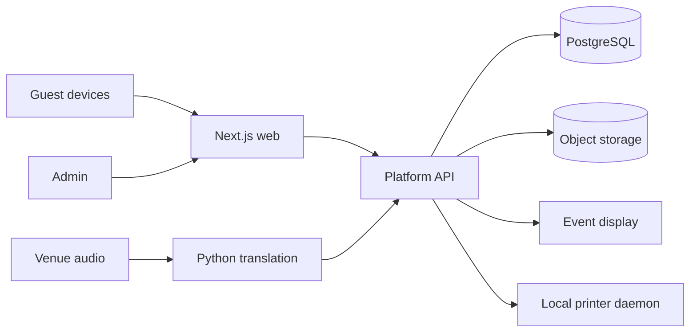

# Architecture Overview
Start as a modular monorepo, not a microservice fleet.

Public/cacheable surfaces may run at the edge. Authoritative private data and event services may remain on the homelab behind an authenticated HTTPS API/tunnel.
Database, object storage, inference and printer services are never directly internet-facing.
