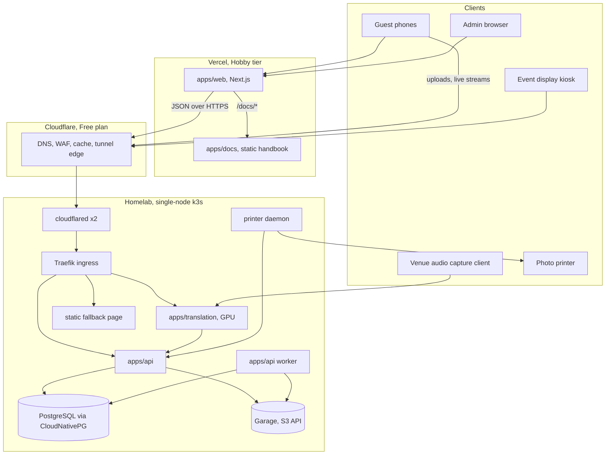

# 2. System context

## 2.1 Component inventory

| Component | Runs where | Technology | Owns | Status today |
| --- | --- | --- | --- | --- |
| apps/web | Vercel | Next.js 15, React 19 | Nothing, stateless | Built, landing and prototypes only |
| apps/docs | Vercel | Next.js, Markdoc | Nothing, static | Built |
| apps/api | k3s | Node 22, TypeScript, one process with modules | All domain logic, all writes | Not started |
| apps/api worker | k3s | Same image, worker entrypoint | Background jobs | Not started |
| PostgreSQL | k3s | CloudNativePG operator, Postgres 17 | System of record | Not started |
| Garage | k3s | Garage v2, S3-compatible | Originals, derivatives, backups | Not started |
| apps/translation | k3s, GPU | Python, Whisper-class model | Nothing, push-only | README only |
| printer daemon | k3s, venue node | Small Node or Python service with CUPS | Nothing, pulls jobs | Not started |
| static fallback | k3s | Static HTML behind Traefik errors middleware | Nothing | Not started |
| cloudflared | k3s | Cloudflare Tunnel connector, two replicas | Nothing | Not started |
| Traefik | k3s, packaged | Ingress controller shipped with k3s | Nothing | Comes with k3s |
| cert-manager | k3s | Helm chart | Certificates | Not started |
| Flux | k3s | GitOps controllers | Cluster state from git | Not started |

## 2.2 Trust zones

| Zone | Contains | Reachable from | Authentication |
| --- | --- | --- | --- |
| Public edge | Vercel pages, docs | Internet | None for public pages; invitation cookie for guest pages |
| Public API hostname | `api.grad26.example` through the tunnel | Internet, via Cloudflare only | Invitation bearer token or cookie, admin session, service tokens |
| Cluster network | Postgres, Garage, worker, translation ingest, printer | Pods allowed by NetworkPolicy | Database credentials, S3 keys, service tokens |
| Ops hostname (optional) | Garage admin, metrics | Internet, via tunnel, behind Cloudflare Access | Cloudflare Access identity |
| Venue LAN | Traefik on the node's LAN address | Devices on the venue network | Same as public API; open item, see section 11 |

The database, object storage, GPU service and printer have no Ingress resource and no Cloudflare hostname. The only way in from the internet is the tunnel, and the tunnel only reaches Traefik.
