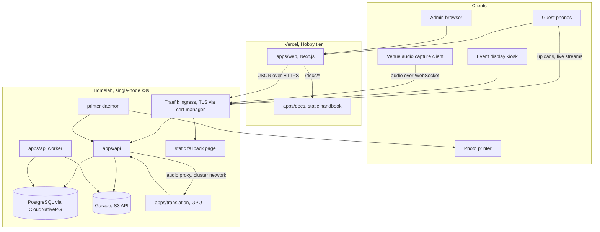

# 2. System context

```mermaid
flowchart TB
  subgraph clients ["Clients"]
    Guest["Guest phones"]
    Admin["Admin browser"]
    AV["Venue audio capture client"]
    Kiosk["Event display kiosk"]
    Printer["Photo printer"]
  end
  subgraph edge ["Vercel, Hobby tier"]
    Web["apps/web, Next.js"]
    Docs["apps/docs, static handbook"]
  end
  subgraph k3s ["Homelab, single-node k3s"]
    Traefik["Traefik ingress, TLS via cert-manager"]
    API["apps/api"]
    Worker["apps/api worker"]
    PG[("PostgreSQL via CloudNativePG")]
    Garage[("Garage, S3 API")]
    Trans["apps/translation, GPU"]
    PrintD["printer daemon"]
    Fallback["static fallback page"]
  end
  Guest --> Web
  Admin --> Web
  Web -- "/docs/*" --> Docs
  Web -- "JSON over HTTPS" --> Traefik
  Guest -- "uploads, live streams" --> Traefik
  Kiosk --> Traefik
  Traefik --> API
  Traefik --> Fallback
  API --> PG
  API --> Garage
  Worker --> PG
  Worker --> Garage
  AV -- "audio over WebSocket" --> Traefik
  API -- "audio proxy, cluster network" --> Trans
  Trans --> API
  PrintD --> API
  PrintD --> Printer
```

## 2.1 Component inventory

| Component | Runs where | Technology | Owns | Status today |
| --- | --- | --- | --- | --- |
| apps/web | Vercel | Next.js 15, React 19 | Nothing, stateless | Built, landing and prototypes only |
| apps/docs | Vercel | Next.js, Markdoc | Nothing, static | Built |
| apps/api | k3s | Node 24, TypeScript, one process with modules | All domain logic, all writes | Container image built, verified end to end; not deployed to k3s |
| apps/api worker | k3s | Same image, worker entrypoint | Background jobs | Not started |
| PostgreSQL | k3s | CloudNativePG operator, Postgres 17 | System of record | Not started |
| Garage | k3s | Garage v2, S3-compatible | Originals, derivatives, backups | Not started |
| apps/translation | k3s, GPU | Python, Whisper-class model | Nothing, push-only | README only |
| printer daemon | k3s, venue node | Small Node or Python service with CUPS | Nothing, pulls jobs | Not started |
| static fallback | k3s | Static HTML behind Traefik errors middleware | Nothing | Not started |
| DDNS updater | k3s | CronJob `ddns` (curl script calling the Spaceship DNS API) keeping the `api.grad26` `A` record current (ADR-009) | Nothing | Running |
| Traefik | k3s, packaged | Ingress controller shipped with k3s, terminates TLS itself | Nothing | Comes with k3s |
| cert-manager | k3s | Helm chart, HTTP-01 `ClusterIssuer` (ADR-009) | Certificates | Not started |
| Flux | k3s | GitOps controllers | Cluster state from git | Not started |

## 2.2 Trust zones

| Zone | Contains | Reachable from | Authentication |
| --- | --- | --- | --- |
| Public edge | Vercel pages, docs | Internet | None for public pages; invitation cookie for guest pages |
| Public API hostname | `api.grad26.fuisloy.dev`, forwarded directly to Traefik (ADR-009) | Internet | Invitation bearer token or cookie, admin session, service tokens |
| Cluster network | Postgres, Garage, worker, translation ingest, printer | Pods allowed by NetworkPolicy | Database credentials, S3 keys, service tokens |
| Ops hostname (optional) | Garage admin, metrics | Internet, same forwarded ports, its own auth (no Cloudflare Access without Cloudflare in front) | To be decided if this hostname is used |
| Venue LAN | Traefik on the node's LAN address | Devices on the venue network | Same as public API; open item, see section 11 |

The database, object storage, GPU service and printer have no Ingress resource and no public hostname. The only way in from the internet is the router's forwarded ports 80/443, and those only reach Traefik — nothing else is forwarded. Unlike the earlier Cloudflare Tunnel design, this means the home connection's real IP is directly visible to anyone who resolves or scans for `api.grad26.fuisloy.dev` (ADR-009); see section 9 and section 10 for the residual risk.
