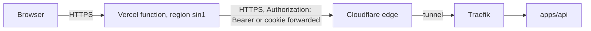
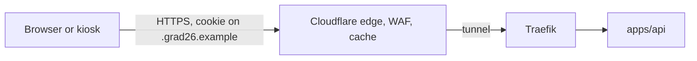

# 3. Traffic paths

Three paths carry all traffic. Which path a feature uses is fixed by the table in section 3.4 and must not drift.

## 3.1 Path A: browser to Vercel to API

Used for HTML pages and small JSON reads and writes. The browser talks only to Vercel. Next.js server components, route handlers and server actions call the API over the tunnel hostname, cache reads, and translate failures into page states.

## 3.2 Path B: browser directly to the API

Used for photo uploads, live translation on phones, and the event display feed. Two hard limits force this path: Vercel functions reject request bodies above 4.5 MB, and long-lived streams are bounded by function duration limits even where WebSockets are available. Streams originate in the cluster, so routing them through Vercel would add a hop and a failure point for no benefit.

The API therefore authenticates every request itself. Vercel is a client like any other.

## 3.3 Path C: inside the cluster

Used by the translation service pushing segments, the worker reading and writing storage, CloudNativePG writing backups to Garage, and the printer daemon pulling jobs. Nothing on this path crosses the tunnel. Access is limited by NetworkPolicy and by per-service tokens.

## 3.4 Feature to path mapping

| Feature | Browser calls | Vercel layer | apps/api | Path |
| --- | --- | --- | --- | --- |
| Landing, docs, ASCII live, 3D prototype | Vercel | serves it | not involved | A, no API call |
| Invitation view | Vercel | token to cookie exchange, cached read | lookup by token hash | A |
| RSVP | Vercel | forward write, retry state | validate and persist | A |
| Calendar, directions, venue info | Vercel | cached read | event configuration | A |
| Digital pass | Vercel | render QR | issue pass payload | A |
| Guest camera upload | apps/api | not involved | store original, enqueue derivatives | B |
| Gallery page | Vercel | cached listing | listing with derivative URLs | A |
| Gallery images | apps/api, cached by Cloudflare | not involved | serve derivative from Garage | B |
| Wishes | Vercel | forward | persist, moderation state | A |
| Live translation on phones | apps/api WebSocket | page shell only | broadcast segments | B |
| Event display | apps/api WebSocket | page shell only | display feed | B |
| Printing | apps/api | admin page | print queue | A for admin, C for daemon |
| Admin moderation | Vercel pages | admin UI | admin endpoints | A |
| Translation ingest | none | none | receives segments | C |

Rule of thumb: anything that touches the database, holds a connection open, or moves large bytes lives in apps/api. Anything that renders HTML or shapes one page's data lives in the Vercel layer. The Vercel layer must stay thin enough to delete.
