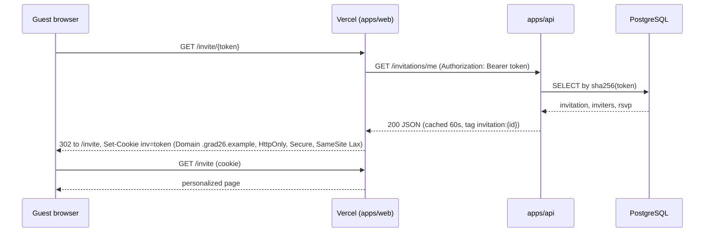
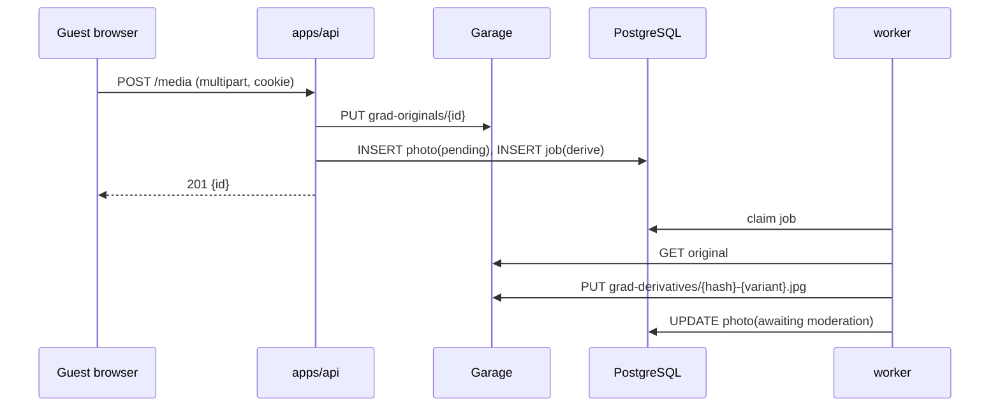
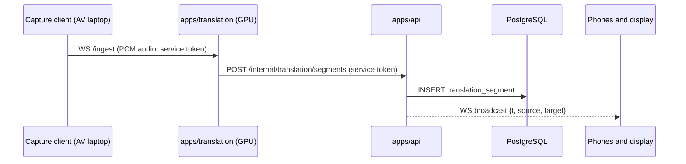

# 6. How the architecture serves the use cases

The experience arc from `product/vision.md` is Before, During, After. Each use case below lists the flow, the components involved, and what happens when something is down.

## 6.1 Before the ceremony

**Personalized invitation.** A graduate creates an invitation in the admin UI; the API generates a token, stores its hash, and links one or more inviters. The guest receives a link carrying the token.

Degradation: if the tunnel is down, Vercel serves the last cached invitation for that tag. A first-time visitor whose invitation was never cached sees a static "we are having trouble, here is the essential event information" page rendered by Vercel from event configuration that is also cached.

**RSVP.** The guest submits attendance from the invitation page. A server action forwards the write to the API with the cookie credential, the API validates and persists, and the action revalidates the invitation tag. If the API is unreachable the page shows an explicit retry state and keeps the form values. Nothing is queued on Vercel; a write either lands or is visibly retried.

**Calendar and directions.** Event configuration is a single JSON document owned by the API and cached on Vercel for five minutes. The calendar file is generated by the API and also cached. Both survive outages.

**Digital pass.** The API signs a compact pass payload (invitation id, guest name, validity window) and the Vercel page renders it as a QR code. Validation at the door reads the signature offline, so the pass works with no network at all.

## 6.2 During the ceremony

**Guest camera.** The gallery page offers upload. The browser posts the file directly to the API hostname with the parent-domain cookie. The API streams it into `grad-originals`, writes a `Photo` row in `pending` state, and enqueues a derivative job. The worker generates stripped, resized variants into `grad-derivatives` and moves the photo to `awaiting moderation`.

Degradation: if Garage is down, uploads fail with a clear message and the guest is asked to retry later; the invitation and everything else keep working. If the tunnel is down and the venue LAN overlay exists, uploads succeed over the LAN; otherwise they wait.

**Gallery.** Vercel renders the listing from a cached API call. Image URLs point at the API's derivative endpoint, which Cloudflare caches at the edge with a long TTL because names are content-addressed. A moderator approving a photo revalidates the listing tag.

**Wishes.** Small text writes follow the RSVP pattern. Wishes appear on the event display once approved.

**Live translation.** The capture client streams audio from the mixer to the translation service's ingest WebSocket. The GPU service emits segments and posts them to the API, which stores them and broadcasts over `WS /live/translation` to phones and `WS /live/display` to the kiosk.

Degradation: the translation pod is a Flux Kustomization that can be suspended. If it is absent the API still serves everything else and the live page shows "translation unavailable". Phones reconnect automatically with backoff; missed segments are refetched by timestamp.

**Event display.** A browser in kiosk mode opens `/display` and connects to `WS /live/display`. The feed carries approved wishes, selected photos and translation. The page shell comes from Vercel unless the venue overlay runs the web mirror, in which case it comes from the LAN.

**Printing.** An admin or, optionally, a guest requests a print of an approved photo. The API enqueues a print job; the printer daemon on the venue node polls for the next job, fetches the derivative, prints through CUPS, and reports completion. If the daemon is absent the queue simply grows and can be drained later.

## 6.3 After the ceremony

**Curated gallery and cohort timeline.** Moderators flag a subset public. Public pages render from Vercel with the same cached listing calls; unflagged photos remain guest-only. Originals stay in `grad-originals` and never leave.

**Yearbook and memory archive.** The four-year archive is the Postgres data plus the two media buckets plus the offsite copy. Because everything is defined in git and restorable from backups, the archive can be re-hosted anywhere later without redesign.

## 6.4 Cross-cutting

**Anonymous visitors** see only Vercel-served pages and any explicitly public gallery items. No anonymous request ever reaches the API except cached derivative fetches.

**Admins** sign in on Vercel; the web app mints a short-lived session token that the API verifies with a shared secret. All admin actions are recorded in the `audit` table.

## 6.5 Degradation matrix

| Failure | Still works | Lost until recovery |
| --- | --- | --- |
| Homelab or tunnel down | Landing, docs, cached invitations, cached event info, pass validation, static fallback | RSVP and wish writes, uploads, live features, admin |
| Vercel down | Direct API paths: uploads, live, display, derivatives; venue LAN if present | All pages unless the web mirror is deployed |
| Cloudflare down | Venue LAN only | Everything internet-facing |
| PostgreSQL down | Cached pages, static fallback via Traefik errors middleware | All API reads and writes |
| Garage down | Invitations, RSVP, wishes, live translation | Uploads, uncached derivatives, backups |
| Translation pod down | Everything else | Live translation |
| Printer down | Everything else | Printing, queue retained |
| GPU driver failure | Everything else | Live translation |
