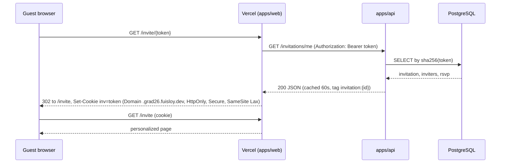
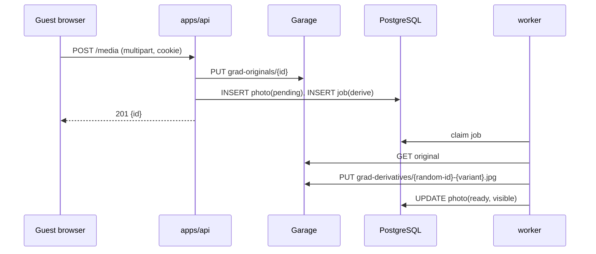
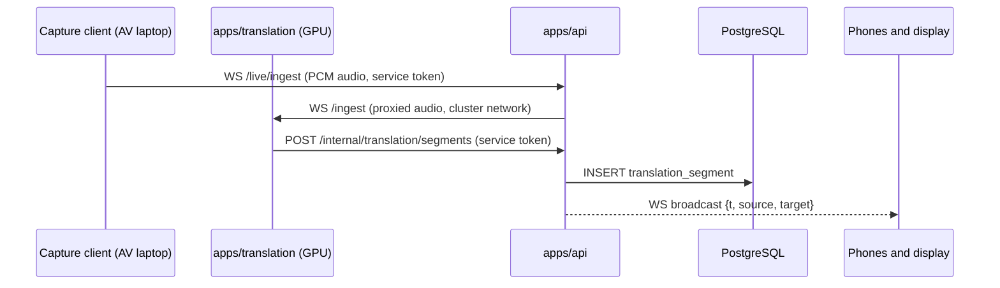

# 6. How the architecture serves the use cases

The experience arc from `product/vision.md` is Before, During, After. Each use case below lists the flow, the components involved, and what happens when something is down.

## 6.1 Before the ceremony

**Personalized invitation.** An admin creates an invitation in the admin UI on behalf of the graduate or graduates (only a few approved admins can; graduates do not sign in); the API generates a token, stores its hash, and links one or more inviters. The guest receives a link carrying the token.

```mermaid
sequenceDiagram
  participant G as Guest browser
  participant V as Vercel (apps/web)
  participant A as apps/api
  participant P as PostgreSQL
  G->>V: GET /invite/{token}
  V->>A: GET /invitations/me (Authorization: Bearer token)
  A->>P: SELECT by sha256(token)
  P-->>A: invitation, inviters, rsvp
  A-->>V: 200 JSON (cached 60s, tag invitation:{id})
  V-->>G: 302 to /invite, Set-Cookie inv=token (Domain .grad26.fuisloy.dev, HttpOnly, Secure, SameSite Lax)
  G->>V: GET /invite (cookie)
  V-->>G: personalized page
```

Degradation: if the tunnel is down, Vercel serves the last cached invitation for that tag. A first-time visitor whose invitation was never cached sees a static "we are having trouble, here is the essential event information" page rendered by Vercel from event configuration that is also cached.

**RSVP.** The guest submits attendance from the invitation page. A server action forwards the write to the API with the cookie credential, the API validates and persists, and the action revalidates the invitation tag. If the API is unreachable the page shows an explicit retry state and keeps the form values. Nothing is queued on Vercel; a write either lands or is visibly retried.

**Calendar and directions.** Event configuration is a single JSON document owned by the API and cached on Vercel for five minutes. The calendar file is generated by the API and also cached. Both survive outages.

**Digital pass.** The API signs a compact pass payload (invitation id, guest name, validity window) and the Vercel page renders it as a QR code. The payload is signed with Ed25519 (the API holds the private key; a verifier needs only the public key named by `keyId`, decided 2026-09-29). The ceremony is a public event and door check-in is not planned, so the pass is a personalized keepsake; signature verification is not on the critical path, but the payload stays signed so a verifier can be built later.

**Pass signature scheme (v1, #35).** Enough for someone to write a verifier without reading the API code:

- `GET /pass` (invitation credential, same `401`/`404`/`410` as `GET /invitations/me`, `Cache-Control: private, no-store`) returns `{ payload, signature, keyId }` (`passResponseSchema`). The payload is `{ v: 1, invitationId, guestName, validFrom, validUntil }` and never holds email, phone, token or hash.
- **Signed bytes:** the UTF-8 encoding of `JSON.stringify` of the payload with keys in exactly the order `v, invitationId, guestName, validFrom, validUntil` and no whitespace (`canonicalPassPayload` in `@grad/contract`). Timestamps are the strings as sent (`toISOString()` form) or `null`.
- **Signature:** pure Ed25519 (RFC 8032, no pre-hash, no context) over those bytes with the private key in `PASS_SIGNING_KEY`, encoded base64url without padding (86 characters).
- **QR text:** `GP1.<keyId>.<base64url(signed bytes)>.<signature>` (`encodePassQr` in `@grad/contract`). The QR carries the signed bytes themselves, so a verifier splits on `.`, base64url-decodes the third segment and verifies it as is, with no JSON re-encoding; base64url also keeps Vietnamese names intact on scanners that misread UTF-8 in QR byte mode. `keyId` may only contain letters, digits, `-` and `_`. A strict verifier rejects segments that are not canonical base64url.
- **Public keys:** `GET /pass/keys` (public, `Cache-Control: public, max-age=300`) returns a JWK Set (`passKeysResponseSchema`): `{ keys: [{ kty: "OKP", crv: "Ed25519", x, kid, alg: "EdDSA", use: "sig" }] }`, where `kid` matches `keyId`. Rotation means a new `PASS_KEY_ID` with the new key; today only the current key is published, so passes signed with a retired key stop verifying.
- **Verifying:** find the key whose `kid` is the second segment, verify the signature over the decoded third segment, then parse it as JSON and check `v` and, if wanted, the validity window. `verifyPassQr` in `apps/api/src/modules/pass/pass.signer.ts` is the reference implementation.
- **Keys:** `PASS_SIGNING_KEY` is an Ed25519 PKCS#8 private key as PEM (literal `\n` escapes allowed) or base64 of the PEM or DER (`openssl genpkey -algorithm ed25519`). Production refuses to start without it. Elsewhere, an unset key makes the API generate an ephemeral key at startup and log a warning, so passes from a previous run no longer verify.

## 6.2 During the ceremony

**Guest camera.** The gallery page offers upload. The browser posts the file directly to the API hostname with the parent-domain cookie. The API streams it into `grad-originals`, writes a `Photo` row in `pending` state, and enqueues a derivative job. The worker generates stripped, resized variants into `grad-derivatives` and marks the photo `ready`. Photos are shown without pre-review (decided 2026-09-27); moderators can hide one afterwards or remove it on request.

```mermaid
sequenceDiagram
  participant G as Guest browser
  participant A as apps/api
  participant S as Garage
  participant P as PostgreSQL
  participant W as worker
  G->>A: POST /media (multipart, cookie)
  A->>S: PUT grad-originals/{id}
  A->>P: INSERT photo(pending), INSERT job(derive)
  A-->>G: 201 {id}
  W->>P: claim job
  W->>S: GET original
  W->>S: PUT grad-derivatives/{random-id}-{variant}.jpg
  W->>P: UPDATE photo(ready, visible)
```

Degradation: if Garage is down, uploads fail with a clear message (`503` with `Retry-After`) and the guest is asked to retry later; the invitation and everything else keep working. If the home connection is down and the venue LAN overlay exists, uploads succeed over the LAN; otherwise they wait.

**Gallery.** Vercel renders the listing from a cached API call. Image URLs point at the API's derivative endpoint. Names still carry a random unguessable identifier so they're safe to share, but there is no edge cache in front of them (ADR-009): every view fetches the derivative from the home connection directly, which is slower for guests than the original Cloudflare-cache design and adds load there on the day. Only visible, processed photos get derivative URLs, and those URLs are shown only to invited guests until a photo is flagged public. A moderator hiding or removing a photo revalidates the listing tag.

**Wishes.** Small text writes follow the RSVP pattern. Wishes appear on the event display while they are visible; a moderator can hide one at any time.

**Live translation.** The capture client streams audio from the mixer to `WS /live/ingest` on the API, which authenticates it and proxies it to the translation service's ingest WebSocket over the cluster network. The GPU service emits segments and posts them to the API, which stores them and broadcasts over `WS /live/translation` to phones and `WS /live/display` to the kiosk.

```mermaid
sequenceDiagram
  participant C as Capture client (AV laptop)
  participant T as apps/translation (GPU)
  participant A as apps/api
  participant P as PostgreSQL
  participant G as Phones and display
  C->>A: WS /live/ingest (PCM audio, service token)
  A->>T: WS /ingest (proxied audio, cluster network)
  T->>A: POST /internal/translation/segments (service token)
  A->>P: INSERT translation_segment
  A-->>G: WS broadcast {t, source, target}
```

Degradation: the translation pod is a Flux Kustomization that can be suspended. If it is absent the API still serves everything else and the live page shows "translation unavailable". Phones reconnect automatically with backoff; missed segments are refetched by timestamp.

**Event display.** A browser in kiosk mode opens `/display` and connects to `WS /live/display`. The feed carries visible wishes, selected photos and translation. The page shell comes from Vercel unless the venue overlay runs the web mirror, in which case it comes from the LAN.

**Printing.** An admin or, optionally, a guest requests a print of a visible photo. The API enqueues a print job; the printer daemon on the venue node polls for the next job, fetches the derivative, prints through CUPS, and reports completion. If the daemon is absent the queue simply grows and can be drained later.

## 6.3 After the ceremony

**Curated gallery and cohort timeline.** Moderators flag a subset public. Public pages render from Vercel with the same cached listing calls; unflagged photos remain guest-only. Originals stay in `grad-originals` and never leave.

**Yearbook and memory archive.** The four-year archive is the Postgres data plus the two media buckets plus the offsite copy. Because everything is defined in git and restorable from backups, the archive can be re-hosted anywhere later without redesign.

## 6.4 Cross-cutting

**Anonymous visitors** see only Vercel-served pages and any explicitly public gallery items. No anonymous request ever reaches the API except cached derivative fetches.

**Admins** sign in on Vercel; the web app mints a short-lived session token that the API verifies with a shared secret. All admin actions are recorded in the `audit` table.

## 6.5 Degradation matrix

| Failure | Still works | Lost until recovery |
| --- | --- | --- |
| Homelab, router, or the home connection down | Landing, docs, cached invitations, cached event info, pass validation, static fallback | RSVP and wish writes, uploads, live features, admin |
| Vercel down | Direct API paths: uploads, live, display, derivatives; venue LAN if present | All pages unless the web mirror is deployed |
| Dynamic DNS stale (ADR-009) | Venue LAN only, until someone notices and fixes the record | Everything internet-facing that resolves the stale IP |
| PostgreSQL down | Cached pages, static fallback via Traefik errors middleware | All API reads and writes |
| Garage down | Invitations, RSVP, wishes, live translation | Uploads, uncached derivatives, backups |
| Translation pod down | Everything else | Live translation |
| Printer down | Everything else | Printing, queue retained |
| GPU driver failure | Everything else | Live translation |
