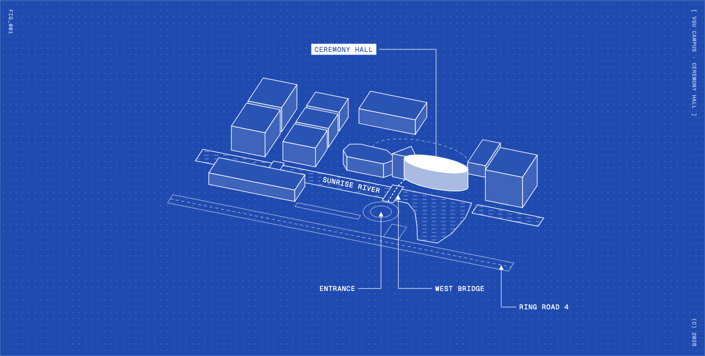
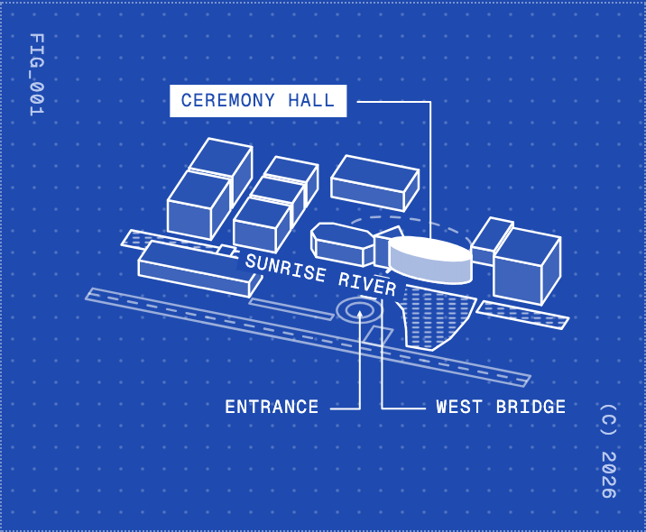

# Illustrative figures (blueprint style)

Every explanatory illustration on a guest-facing page, such as a map, a cutaway, an exploded view or a how-it-works drawing, uses this one style. Follow it strictly. Do not mix it with other illustration styles, and do not change a value below without human design review.

The canonical implementation is **FIG_001**, the campus blueprint on `/venue` (`apps/web/app/venue/CampusFigure.tsx`, `campus-figure.ts`, styles in `venue.css`). Copy its structure for every new figure.

| Desktop | Mobile |
| --- | --- |
|  |  |

## Reference

The style follows the technical figures in Dan Hollick's [Making Software](https://www.makingsoftware.com/) (the floppy-disk exploded view, the cathode-ray tube cutaway and the touchscreen layers), inverted to **white line work on `--brand-blue`**. Study those figures before drawing a new one. Take the drawing grammar from them, but never their content, their pixel typeface or their blue-on-white palette.

What to take from the reference:

- A figure is a framed plate: a dot-grid field inside a dotted border, with small vertical marginal tags (`FIG_00X`, `[ TITLE ]`, a year).
- Drawings are axonometric line work: single-weight strokes, flat tinted faces and no perspective.
- The subject is the one solidly filled object, and everything else stays lightly tinted.
- Labels are small monospace capitals on straight leader lines that end in small solid arrowheads.
- Dashed lines show paths, guides and hidden or implied edges.

## When to use it

- **Use it** to show where something is or how something works: a venue map, a route, a cutaway of a device, a process drawn as objects.
- **Do not use it** as decoration or page furniture, behind text or as a background. It may share a screen with the facts it explains, like FIG_001 beside the venue details. The ASCII sculpture remains the only signature motif (`anti-patterns.md`). A figure must explain something the surrounding text refers to.
- **Surface:** figures sit only on blue (`Section tone="blue"`). There is no on-white variant. A white-surface figure needs design review first.
- **At most one figure per view.** Number figures in order across the site (`FIG_001`, `FIG_002`, …) and record each new one in the register at the end of this page.

## Anatomy

```
┌ · · · · · · · · · · · · · · · · · · · · · · · · · ┐   dotted 1px frame
F                                  ┌──────────────┐  [
I            ┌──────────────────── │ SUBJECT      │  T
G            │                     └──────────────┘  I   vertical marginal tags
_      ▱▱▱   ▼                                       T   (FIG_00X top left,
0    ▱▱▱▱▱ ███  ← subject: the only solid fill       L   [ TITLE ] top right,
0      ▱▱▱                                           E   year bottom right)
1    ═══════ INLINE LABEL ═══════  ← label on a feature  ]
            ▲                ▲
   LABEL ───┘                └─── LABEL               (C)
· · · · · · · · · · · · · · · · · · · · · · · · · · ·  2026
```

## Specification

### Plate

- `<figure>` with `position: relative`, padding `var(--space-6) var(--space-7)` (`var(--space-6) var(--space-5)` at or below 640px), and `border: 1px dotted` white at 40% (`color-mix(in srgb, var(--brand-white) 40%, transparent)`).
- **Dot grid:** an absolutely positioned SVG behind the drawing with **no viewBox**, so dots stay a constant pixel size. Use a `<pattern>` 12×12 user units (CSS px) with one circle `r="0.9"` at its centre, filled white at 22%. Never use a CSS gradient for it, because brand CSS forbids gradients.
- **Marginal tags:** Geist Mono, 10px, `letter-spacing: 0.08em`, `color: var(--brand-muted)`, `writing-mode: vertical-rl`. Place them inset by `--space-3` from the side and `--space-4` from the top or bottom:
  - `FIG_00X` at top left;
  - `[ SUBJECT · CONTEXT ]` in capitals at top right (hidden at or below 640px);
  - `(C) YYYY` at bottom right.

### Drawing

- **Projection:** axonometric, never perspective. Rotate the plan, squash it vertically and lift height straight up. FIG_001 uses a 20° rotation and a 0.55 squash, so long features run nearly across the frame. Pick the rotation that makes the subject's main axis read left to right, and keep the projection identical across every object in one figure.
- **Strokes:** `var(--brand-white)`, 1.25px, `vector-effect: non-scaling-stroke`, round joins and caps. Strokes have one weight only; never vary it for emphasis. The only exception is the dotted route, which is 2px.
- **Faces:** extruded objects show only the walls facing the viewer, drawn back to front and then the top face. All fills use `color-mix` with `--brand-blue`, so faces hide what is behind them:

  | Part | Fill |
  | --- | --- |
  | Top face | white 5% |
  | Visible wall | white 14% |
  | **Subject** top | white 100% |
  | **Subject** wall | white 62% |

- **Curved objects** (ellipses, discs and the like) are 48 to 64 facets. Fill the facets edge to edge with no per-facet outline, and stroke one silhouette instead: up one end, along the visible base, up the other end. Visible facet seams are a defect.
- **The subject** is the single solid-white object. Exactly one per figure, and nothing else may be solid white except arrowheads and the subject's label tag.
- **Context** (roads, ground features, outlines of secondary areas) is drawn flat at z = 0. Use strokes at white 55% with no fill. Show at most the few neighbours a reader needs to orient themselves, and crop everything else.
- **Water and similar materials:** a hatch of short horizontal dashes (`<pattern>` 18×7, an 8-unit dash, white 60%, 1px) clipped to the outline. Then stroke the outline on top.
- **Dashes:**

  | Meaning | Dash pattern |
  | --- | --- |
  | Guides, centre lines, implied boundaries | `5 6` |
  | A route the reader should follow | `2 5`, 2px |

  Use one route per figure at most.
- **Occluders** (a bridge over water, for example) are filled `--brand-blue` so they cut the hatch beneath them.

### Labels

- **Text:** HTML laid over the SVG, never SVG `<text>`, so they keep a readable size at any width. Geist Mono, `clamp(10px, 0.5rem + 0.35vw, 13px)`, uppercase, `letter-spacing: 0.06em`, `line-height: 1`, white, `white-space: nowrap`. Position each label by percentages of the drawing's viewBox.
- **Leaders:** a 1px white line that runs horizontally from the label and then makes one vertical drop onto the anchor, ending in a solid white arrowhead 9 units long and 9 wide. A label level with its anchor gets one straight horizontal arrow. Never draw diagonal or curved leaders, and never more than one bend.
- **Label lanes:** labels sit in clear lanes above or below the drawing, or beside it. A label never sits on top of line work. Crossing context strokes with a leader is acceptable. Running a leader through a building is not: move the label, or drop it.
- **Subject label:** the same text set as a tag, `padding: 4px 6px`, white background and `--brand-blue` text. It is the only boxed label.
- **Inline labels:** used for long, thin features such as a river or a road. Write the label along the feature, rotated to its on-screen angle, on a `--brand-blue` chip (`padding: 1px 4px`), with no leader.
- **Number and wording:** 3 to 6 labels in total. Use names a guest would say on the day, such as `CEREMONY HALL` or `WEST BRIDGE`, not internal codes. Mark the least important labels `minor`; they are hidden at or below 640px.

### Layout and responsiveness

- **Width:** the drawing stage is centred, `width: 100%` and `max-width: min(1100px, calc(68svh * var(--fig-ratio)))`, so a figure is never taller than about two thirds of the screen. `--fig-ratio` is the viewBox's width divided by its height.
- **viewBox:** computed from the drawing plus the label points, with 60 units of padding, so nothing is clipped.
- **Phone check:** at 360px wide, every label must be fully inside the frame and no two labels may touch. Check 390 and 1440 as well, using screenshots.

### Accessibility

- The SVGs, labels and marginal tags are `aria-hidden`.
- The `<figure>` is `aria-labelledby` a visually hidden `<figcaption class="brand-sr-only">`. The caption describes the figure in plain sentences: what is shown, what is highlighted, and how to get there or how it works.
- Labels must reach at least 4.5:1 on `--brand-blue` (white does). Never put text on the dot field without enough contrast.
- The figure must read completely with motion off and without JavaScript. See Motion.

### Motion

Motion in a figure is small and explanatory, and there are only two kinds:

1. **Ambient dots** show movement that the figure is about.
   - **Walkers:** white circles, r 4.5 units, moving along the dotted route toward the subject. Use three, evenly spaced, with a 6s loop.
   - **Current:** circles at white 75%, r 2.2, drifting along a flow line such as a river's centre line. Use five, with a 14s loop.
   - Animate with SVG `<animateMotion>` along the same projected path as the line they follow. Use negative `begin` offsets so the dots are evenly spaced from the first frame.
   - Never add dots that don't stand for something real: no particles, sparkles or pulses.
2. **One-time label reveal,** the first time the figure is at least 35% in view (`FigureReveal`, IntersectionObserver). It never replays.
   - Leaders draw in with `stroke-dashoffset` on a `pathLength={1}` path, over 480ms.
   - Each arrowhead fades in at the end of its leader.
   - Each label wipes in from left to right with `clip-path`, over 520ms, 240ms after its leader starts.
   - Items are staggered by 140ms in label order through `--i`, and inline labels come last.
   - Use `var(--ease)` for all of it.

Rules:

- Labels are rendered visible on the server. Only the client hides them (`data-reveal="pending"`) before revealing, so the figure reads without JavaScript.
- `prefers-reduced-motion: reduce` hides the ambient dots and shows the labels immediately, with no transitions.
- Nothing else in a figure moves: no hover effects, no parallax, no camera moves, no looping highlight on the subject.

### Data rules

- If a figure shows event facts (a venue, a date), gate it on the event configuration so it is never wrong. FIG_001 only renders while the configured venue name matches "Ceremony Hall".
- Trace geometry from an authoritative source, such as the official campus map. Heights and other illustrative values may be invented, and must be marked as illustrative in the code.

## Implementation pattern

1. **Pure data module** (`<name>-figure.ts`): plan-coordinate geometry, `project()`, `extrude()`, labels and the computed `VIEW`. No React, so it can be unit tested.
2. **Server component** (`<Name>Figure.tsx`): renders the plate, the dot SVG, the drawing SVG, the ambient dots, the HTML labels and the hidden caption, wrapped in the small client `FigureReveal`. That wrapper is the only client JavaScript. Prefix pattern and clip ids with the figure number (`fig001-dots`).
3. **Styles** in the route stylesheet, under a `<name>-fig` block, using tokens only.
4. **Tests** (`<name>-figure.test.ts`): wall visibility, exactly one subject, and every label inside the viewBox.

Reuse `project`, `extrude`, `ellipse`, `rect`, `toPath` and `toPercent` from `campus-figure.ts`. If a second figure needs them, move them into a shared module rather than copying them.

## Checklist before shipping a figure

- [ ] It explains something the page text refers to. It is not decoration.
- [ ] It sits on a blue band, is the only figure in view, and is numbered and registered below.
- [ ] Exactly one solid-white subject, and that subject is the only boxed label.
- [ ] One stroke weight; no gradients, shadows, blur, perspective or colour other than the brand tokens above.
- [ ] Curved objects have a single silhouette and no facet seams.
- [ ] Leaders are horizontal then vertical with at most one bend, no label overlaps line work, and there are 3 to 6 labels.
- [ ] It looks right at 360, 390 and 1440 wide, and is no taller than about two thirds of the screen.
- [ ] It has a hidden figcaption with a plain-language description, and every graphic is `aria-hidden`.
- [ ] Motion is limited to meaningful ambient dots and the one-time label reveal, and reduced motion shows a still, fully labelled figure.
- [ ] Event facts are gated on the event configuration.

## Figure register

| No. | Page | Subject | Source |
| --- | --- | --- | --- |
| FIG_001 | `/venue` | Ceremony Hall on Sunrise River, VGU campus | Official VGU campus map (geometry traced; heights illustrative) |
