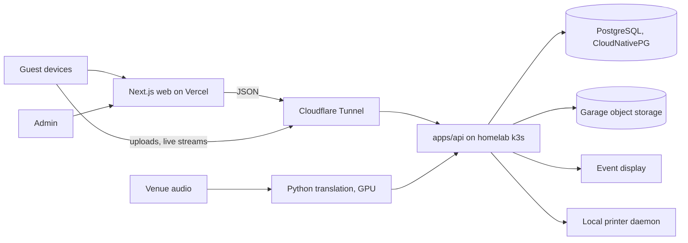

# Architecture Overview
Start as a modular monorepo, not a microservice fleet. The full design, including how each use case flows through it, the Kubernetes workloads and the network setup, is in `architecture/target-architecture.md`.

Public and cacheable surfaces run at the edge on Vercel. Authoritative private data and event services run on the homelab behind a Cloudflare Tunnel; the homelab never opens an inbound port.
Small reads and writes go through Vercel, which caches them so invitations survive an outage. Uploads and live streams go from the browser straight to the API hostname.
Database, object storage, inference and printer services are never directly internet-facing.
