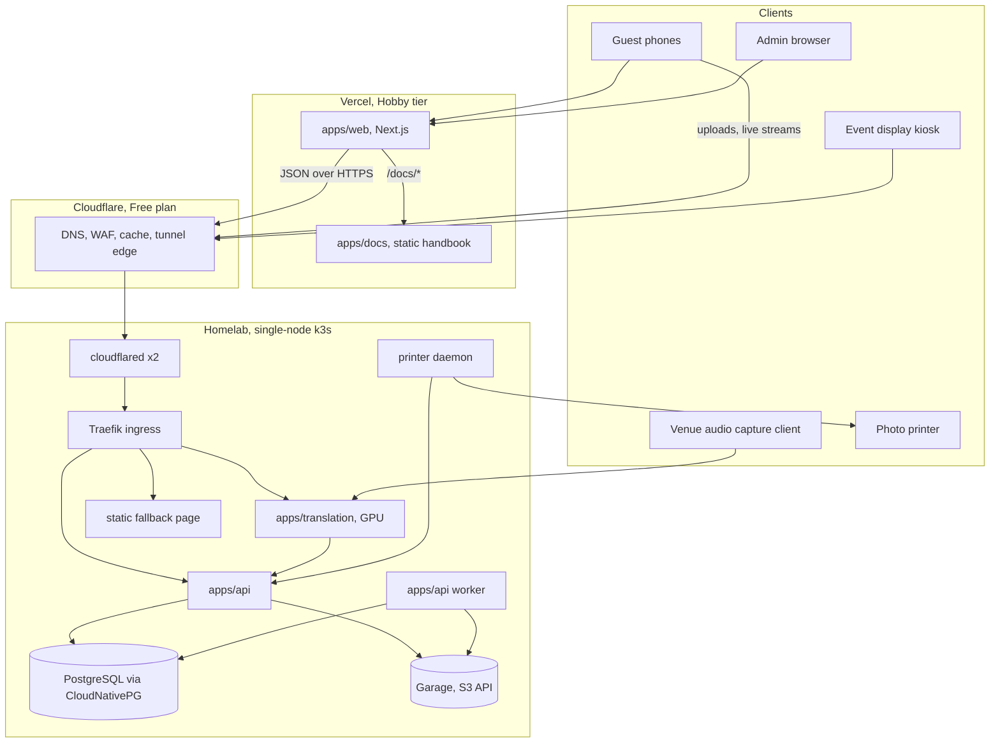
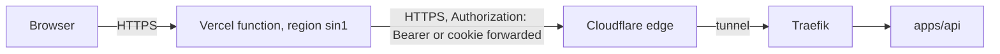
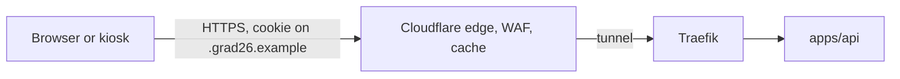
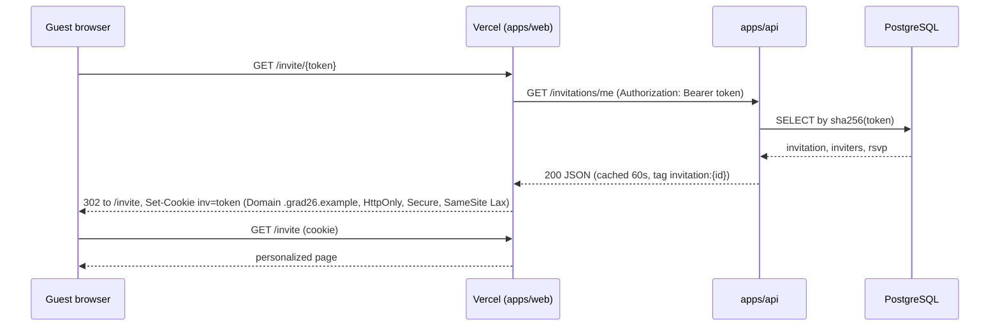
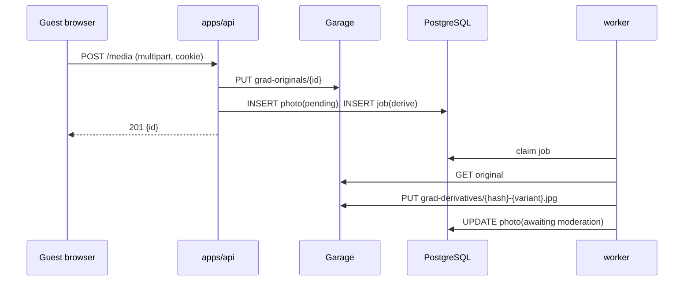
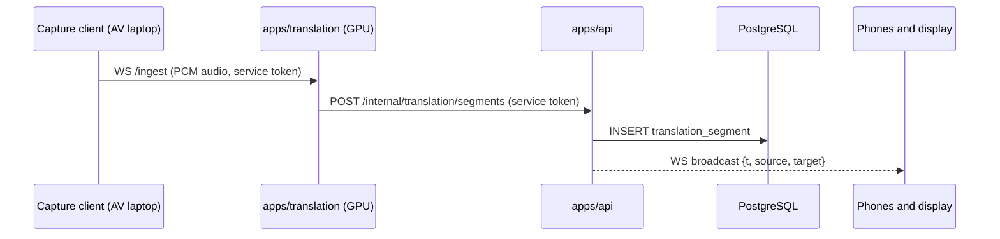

# Target Architecture

Status: Proposed. Date: 2026-09-26. Supersedes the diagram in `architecture/overview.md` once accepted; decisions listed in section 11 become ADRs.

This document is the complete description of the GRAD '26 platform: what runs where, why, how each product use case flows through it, how the homelab Kubernetes cluster is built, and everything that has to be configured on the network side. It is written for a free-tier budget with a mandatory homelab. Where a choice is still open it is marked as such.

Placeholders: `grad26.example` stands for the real domain, `<owner>` for the GitHub owner of the repository and container images. Versions are the ones current at the time of writing and must be re-pinned when manifests are written.

## 1. Goals and constraints

**Product goals** (from `product/vision.md` and `product/principles.md`):

- Invitation first. The invitation, RSVP, calendar and venue information must ship first and survive every other failure.
- One experience, not many apps. The invitation is the identity that unlocks every utility.
- Physical and digital reinforce one event: phones, event display, camera, prints.
- Local ownership. Private and event data stay under project control.
- Graceful failure. 3D, printing and translation may fail without touching critical flows.
- Archive quality. Originals are preserved privately; optimized derivatives are served.

**Engineering constraints** (from `AGENTS.md`):

- TypeScript for web and platform, Python for ML inference.
- pnpm and Turborepo, one repository, a modular monolith rather than microservices.
- PostgreSQL, object storage, printer and inference are never directly internet-facing.
- Invitation URLs are bearer credentials. Tokens and guest PII are never logged.
- Mobile-first and resilient to poor venue networks.

**Operational constraints** (decided in discussion):

- Zero recurring cost beyond the domain. Vercel Hobby, Cloudflare Free, self-hosted everything else.
- The stateful core runs on a homelab. This is mandatory; its risks are documented in section 9 rather than designed away.
- The homelab runs k3s, managed by Flux from this repository with Kustomize overlays. Upstream Helm charts are used wherever a service ships one.
- Object storage is Garage.

**Non-goals**: high availability, multi-region, autoscaling, and any managed cloud data service.

## 2. System context



### 2.1 Component inventory

| Component | Runs where | Technology | Owns | Status today |
| --- | --- | --- | --- | --- |
| apps/web | Vercel | Next.js 15, React 19 | Nothing, stateless | Built, landing and prototypes only |
| apps/docs | Vercel | Next.js, Markdoc | Nothing, static | Built |
| apps/api | k3s | Node 22, TypeScript, one process with modules | All domain logic, all writes | Not started |
| apps/api worker | k3s | Same image, worker entrypoint | Background jobs | Not started |
| PostgreSQL | k3s | CloudNativePG operator, Postgres 17 | System of record | Not started |
| Garage | k3s | Garage v2, S3-compatible | Originals, derivatives, backups | Not started |
| apps/translation | k3s, GPU | Python, Whisper-class model | Nothing, push-only | README only |
| printer daemon | k3s, venue node | Small Node or Python service with CUPS | Nothing, pulls jobs | Not started |
| static fallback | k3s | Static HTML behind Traefik errors middleware | Nothing | Not started |
| cloudflared | k3s | Cloudflare Tunnel connector, two replicas | Nothing | Not started |
| Traefik | k3s, packaged | Ingress controller shipped with k3s | Nothing | Comes with k3s |
| cert-manager | k3s | Helm chart | Certificates | Not started |
| Flux | k3s | GitOps controllers | Cluster state from git | Not started |

### 2.2 Trust zones

| Zone | Contains | Reachable from | Authentication |
| --- | --- | --- | --- |
| Public edge | Vercel pages, docs | Internet | None for public pages; invitation cookie for guest pages |
| Public API hostname | `api.grad26.example` through the tunnel | Internet, via Cloudflare only | Invitation bearer token or cookie, admin session, service tokens |
| Cluster network | Postgres, Garage, worker, translation ingest, printer | Pods allowed by NetworkPolicy | Database credentials, S3 keys, service tokens |
| Ops hostname (optional) | Garage admin, metrics | Internet, via tunnel, behind Cloudflare Access | Cloudflare Access identity |
| Venue LAN | Traefik on the node's LAN address | Devices on the venue network | Same as public API; open item, see section 11 |

The database, object storage, GPU service and printer have no Ingress resource and no Cloudflare hostname. The only way in from the internet is the tunnel, and the tunnel only reaches Traefik.

## 3. Traffic paths

Three paths carry all traffic. Which path a feature uses is fixed by the table in section 3.4 and must not drift.

### 3.1 Path A: browser to Vercel to API

Used for HTML pages and small JSON reads and writes. The browser talks only to Vercel. Next.js server components, route handlers and server actions call the API over the tunnel hostname, cache reads, and translate failures into page states.



### 3.2 Path B: browser directly to the API

Used for photo uploads, live translation on phones, and the event display feed. Two hard limits force this path: Vercel functions reject request bodies above 4.5 MB, and long-lived streams are bounded by function duration limits even where WebSockets are available. Streams originate in the cluster, so routing them through Vercel would add a hop and a failure point for no benefit.



The API therefore authenticates every request itself. Vercel is a client like any other.

### 3.3 Path C: inside the cluster

Used by the translation service pushing segments, the worker reading and writing storage, CloudNativePG writing backups to Garage, and the printer daemon pulling jobs. Nothing on this path crosses the tunnel. Access is limited by NetworkPolicy and by per-service tokens.

### 3.4 Feature to path mapping

| Feature | Browser calls | Vercel layer | apps/api | Path |
| --- | --- | --- | --- | --- |
| Landing, docs, ASCII live, 3D prototype | Vercel | serves it | not involved | A, no API call |
| Invitation view | Vercel | token to cookie exchange, cached read | lookup by token hash | A |
| RSVP | Vercel | forward write, retry state | validate and persist | A |
| Calendar, directions, venue info | Vercel | cached read | event configuration | A |
| Digital pass | Vercel | render QR | issue pass payload | A |
| Guest camera upload | apps/api | not involved | store original, enqueue derivatives | B |
| Gallery page | Vercel | cached listing | listing with derivative URLs | A |
| Gallery images | apps/api, cached by Cloudflare | not involved | serve derivative from Garage | B |
| Wishes | Vercel | forward | persist, moderation state | A |
| Live translation on phones | apps/api WebSocket | page shell only | broadcast segments | B |
| Event display | apps/api WebSocket | page shell only | display feed | B |
| Printing | apps/api | admin page | print queue | A for admin, C for daemon |
| Admin moderation | Vercel pages | admin UI | admin endpoints | A |
| Translation ingest | none | none | receives segments | C |

Rule of thumb: anything that touches the database, holds a connection open, or moves large bytes lives in apps/api. Anything that renders HTML or shapes one page's data lives in the Vercel layer. The Vercel layer must stay thin enough to delete.

## 4. Applications and repository layout

### 4.1 apps/web (Vercel)

Unchanged in role. It gains:

- Guest routes: `/invite/[token]` performs the cookie exchange and redirects to `/invite`; `/invite`, `/rsvp`, `/pass`, `/gallery`, `/wishes`, `/live`, `/display` render from API data.
- Admin routes under `/admin`, protected by an application session. The exact identity provider is deferred; the default is a GitHub sign-in with an allowlist of handles.
- A thin BFF layer: route handlers and server actions that call the API with the forwarded invitation credential, use `fetch` caching with revalidation on reads, and map API failures to explicit page states. No domain logic lives here.
- Function region pinned to Singapore (`sin1`) so the hop to a homelab in Ho Chi Minh City stays short.

Caching policy for the Vercel layer:

| Data | Cache | Reason |
| --- | --- | --- |
| Event configuration, venue info | Revalidate every 5 minutes | Rarely changes, must survive outages |
| Invitation and RSVP state | Revalidate every 60 seconds, tagged per invitation | Stale pass beats no pass; RSVP write revalidates the tag |
| Gallery listing | Revalidate every 60 seconds | Moderator changes appear within a minute |
| Wishes | Revalidate every 30 seconds | Same |
| Admin views | No cache | Must be current |

### 4.2 apps/docs (Vercel)

Unchanged. Served under `/docs` by rewrite from the web project as documented in `operations/deployment.md`.

### 4.3 apps/api (new, k3s)

One Node 22 process built with a small HTTP framework that supports WebSockets natively. Modules are directories with their own routes, services and repositories; they share one database connection pool and one storage client.

| Module | Responsibilities | Endpoints (illustrative) |
| --- | --- | --- |
| invitations | Token issue, hash lookup, rotate, revoke, joint inviters | `GET /invitations/me`, `POST /admin/invitations`, `POST /admin/invitations/{id}/rotate` |
| rsvp | Attendance state per invitation, plus-ones | `PUT /rsvp`, `GET /admin/rsvp` |
| event | Public event configuration, venue, calendar payload | `GET /event`, `GET /event/calendar.ics` |
| pass | Signed pass payload for QR | `GET /pass` |
| media | Upload originals, list gallery, serve derivatives, moderation | `POST /media`, `GET /gallery`, `GET /media/{id}/{variant}`, `POST /admin/media/{id}/moderate` |
| wishes | Submit and list wishes with moderation | `POST /wishes`, `GET /wishes`, `POST /admin/wishes/{id}/moderate` |
| live | WebSocket fan-out for translation and display | `WS /live/translation`, `WS /live/display` |
| translation | Ingest segments from the GPU service | `POST /internal/translation/segments` |
| print | Print job queue | `POST /print/jobs`, `GET /internal/print/jobs/next`, `POST /internal/print/jobs/{id}/done` |
| admin | Cross-cutting admin queries | `GET /admin/overview` |
| system | Health and metrics | `GET /healthz`, `GET /readyz`, `GET /metrics` |

Runtime behavior:

- Migrations run in an init container of the API Deployment using an advisory lock, so a rollout never races itself.
- The worker is the same image started with a worker entrypoint. It polls a `jobs` table in Postgres for derivative generation, moderation notifications and print job dispatch. No message broker.
- Authentication: invitation tokens arrive as `Authorization: Bearer` from Vercel or as an `HttpOnly` cookie scoped to `.grad26.example` from browsers on path B. Tokens are 128-bit random values; only a SHA-256 hash is stored; comparison is constant-time. Service calls on path C use static bearer tokens from Secrets. Admin calls carry a session token signed by the web app.
- Logging: structured JSON; `Authorization`, `Cookie` and any field named `token` are redacted at the logger. Request paths never contain tokens.
- CORS: allows `https://grad26.example` with credentials, nothing else.
- Uploads: multipart streaming straight to Garage, size-capped at 25 MB per file, content-type sniffed, EXIF stripped by the worker when generating derivatives.

Configuration is environment-only:

| Variable | Source |
| --- | --- |
| `DATABASE_URL` | CloudNativePG generated Secret `grad-db-app`, key `uri` |
| `S3_ENDPOINT`, `S3_REGION`, `S3_ACCESS_KEY_ID`, `S3_SECRET_ACCESS_KEY` | SOPS-encrypted Secret `api-s3` |
| `S3_BUCKET_ORIGINALS`, `S3_BUCKET_DERIVATIVES` | ConfigMap |
| `PUBLIC_ORIGIN`, `API_ORIGIN`, `COOKIE_DOMAIN` | ConfigMap |
| `SERVICE_TOKEN_TRANSLATION`, `SERVICE_TOKEN_PRINTER` | SOPS-encrypted Secret `api-service-tokens` |
| `ADMIN_SESSION_SECRET` | SOPS-encrypted Secret, shared with the web app on Vercel |
| `LOG_LEVEL` | ConfigMap |

### 4.4 apps/translation (k3s, GPU)

Python service. It exposes one WebSocket ingest endpoint for audio and pushes finished segments to the API over the cluster network with its service token. It never touches the database or storage and can be absent without the API noticing. Audio reaches it from a small capture client running on the AV laptop at the mixer. Where the GPU machine physically sits on ceremony day is an open item (section 11).

### 4.5 packages/contract (new)

Request and response schemas shared by apps/web and apps/api, written once as runtime validators with inferred TypeScript types. A change to an endpoint fails the web app's typecheck instead of failing at the venue.

### 4.6 deploy/ (new): everything Flux reconciles

```
deploy/
  clusters/
    home/
      flux-system/            generated by flux bootstrap
      infra-controllers.yaml  Flux Kustomization
      infra-configs.yaml      Flux Kustomization, dependsOn infra-controllers
      apps.yaml               Flux Kustomization, dependsOn infra-configs
    venue/                    open item, same shape with the venue overlay
  infra/
    controllers/              cert-manager, cloudnative-pg, plugin-barman-cloud, nvidia-device-plugin
    configs/                  namespaces, ClusterIssuer, RuntimeClass, Traefik middlewares, NetworkPolicies
  apps/
    base/                     api, worker, postgres, garage, cloudflared, translation, printer, fallback, web-mirror
    home/                     kustomization.yaml + patches: translation on, printer off, web-mirror off
    venue/                    open item: printer on, web-mirror on
  charts/
    garage/                   vendored copy of the upstream chart, pinned to the Garage release
```

Secrets are committed only as SOPS-encrypted files named `*.sops.yaml`. The `.sops.yaml` rules file at the repository root restricts encryption to those paths.

### 4.7 Images and registry

| Image | Built from | Registry | Notes |
| --- | --- | --- | --- |
| `ghcr.io/<owner>/grad-api` | `apps/api`, pruned workspace | GHCR, private | Contains no secrets; no private dependencies |
| `ghcr.io/<owner>/grad-translation` | `apps/translation` | GHCR, private | CUDA runtime base |
| `ghcr.io/<owner>/grad-web` | `apps/web`, standalone output | GHCR, private | Bundles the private ASCII dependency, so it must stay private; only used by the venue overlay |
| `ghcr.io/<owner>/grad-printer` | `apps/printer` or a subfolder of api | GHCR, private | CUPS plus a job poller |

GitHub Actions builds on push to `main` with tags of the form `main-<sha>-<unix-timestamp>`. The web image build receives the GitHub read token as a BuildKit secret mount, never as a build argument or layer. Flux image automation watches GHCR, picks the newest timestamp, and commits the tag bump to a bot branch that is merged under review. Actions minutes are conserved by building on a self-hosted runner on the homelab if the free quota runs short.

## 5. Data and storage

### 5.1 PostgreSQL

One CloudNativePG `Cluster` with a single instance on the local-path storage class. Entities follow `architecture/data-model.md`: `User`, `Guest`, `Invitation`, `InvitationInviter`, `RSVP`, `Photo`, `Wish`, `TranslationSegment`, plus a `jobs` table for the worker and an `audit` table for admin actions.

Backups use the Barman Cloud plugin, which requires CloudNativePG 1.26 or newer and replaces the deprecated in-tree object store configuration. Continuous WAL archiving plus a nightly base backup go to the `grad-backups` bucket in Garage. Retention is 30 days. Restore is rehearsed once before the ceremony by bootstrapping a scratch cluster from the backup.

### 5.2 Garage buckets

| Bucket | Content | Access key | Exposure |
| --- | --- | --- | --- |
| `grad-originals` | Full-resolution uploads, immutable, never served | `api-key` read and write | Cluster only |
| `grad-derivatives` | Resized and stripped variants, content-addressed names | `api-key` read and write | Served by the API, cached by Cloudflare |
| `grad-backups` | Postgres base backups and WAL | `backup-key` read and write | Cluster only |

Keys are generated in advance, stored SOPS-encrypted, and imported into Garage during bootstrap so that git remains the source of truth for credentials. Garage runs with replication factor 1 on the single node.

### 5.3 Offsite copy

A CronJob runs `rclone sync` nightly from all three buckets to an offsite target. The target is an open item: a disk at a second household reached over Tailscale is the free option; a paid object storage bucket is the low-effort option. Either way the copy is encrypted client-side by rclone and a restore from it is part of the pre-event drill.

### 5.4 What never leaves the cluster

Original photos, raw tokens (never stored at all), database credentials and S3 keys. Derivatives are the only media that cross the tunnel.

## 6. How the architecture serves the use cases

The experience arc from `product/vision.md` is Before, During, After. Each use case below lists the flow, the components involved, and what happens when something is down.

### 6.1 Before the ceremony

**Personalized invitation.** A graduate creates an invitation in the admin UI; the API generates a token, stores its hash, and links one or more inviters. The guest receives a link carrying the token.



Degradation: if the tunnel is down, Vercel serves the last cached invitation for that tag. A first-time visitor whose invitation was never cached sees a static "we are having trouble, here is the essential event information" page rendered by Vercel from event configuration that is also cached.

**RSVP.** The guest submits attendance from the invitation page. A server action forwards the write to the API with the cookie credential, the API validates and persists, and the action revalidates the invitation tag. If the API is unreachable the page shows an explicit retry state and keeps the form values. Nothing is queued on Vercel; a write either lands or is visibly retried.

**Calendar and directions.** Event configuration is a single JSON document owned by the API and cached on Vercel for five minutes. The calendar file is generated by the API and also cached. Both survive outages.

**Digital pass.** The API signs a compact pass payload (invitation id, guest name, validity window) and the Vercel page renders it as a QR code. Validation at the door reads the signature offline, so the pass works with no network at all.

### 6.2 During the ceremony

**Guest camera.** The gallery page offers upload. The browser posts the file directly to the API hostname with the parent-domain cookie. The API streams it into `grad-originals`, writes a `Photo` row in `pending` state, and enqueues a derivative job. The worker generates stripped, resized variants into `grad-derivatives` and moves the photo to `awaiting moderation`.



Degradation: if Garage is down, uploads fail with a clear message and the guest is asked to retry later; the invitation and everything else keep working. If the tunnel is down and the venue LAN overlay exists, uploads succeed over the LAN; otherwise they wait.

**Gallery.** Vercel renders the listing from a cached API call. Image URLs point at the API's derivative endpoint, which Cloudflare caches at the edge with a long TTL because names are content-addressed. A moderator approving a photo revalidates the listing tag.

**Wishes.** Small text writes follow the RSVP pattern. Wishes appear on the event display once approved.

**Live translation.** The capture client streams audio from the mixer to the translation service's ingest WebSocket. The GPU service emits segments and posts them to the API, which stores them and broadcasts over `WS /live/translation` to phones and `WS /live/display` to the kiosk.



Degradation: the translation pod is a Flux Kustomization that can be suspended. If it is absent the API still serves everything else and the live page shows "translation unavailable". Phones reconnect automatically with backoff; missed segments are refetched by timestamp.

**Event display.** A browser in kiosk mode opens `/display` and connects to `WS /live/display`. The feed carries approved wishes, selected photos and translation. The page shell comes from Vercel unless the venue overlay runs the web mirror, in which case it comes from the LAN.

**Printing.** An admin or, optionally, a guest requests a print of an approved photo. The API enqueues a print job; the printer daemon on the venue node polls for the next job, fetches the derivative, prints through CUPS, and reports completion. If the daemon is absent the queue simply grows and can be drained later.

### 6.3 After the ceremony

**Curated gallery and cohort timeline.** Moderators flag a subset public. Public pages render from Vercel with the same cached listing calls; unflagged photos remain guest-only. Originals stay in `grad-originals` and never leave.

**Yearbook and memory archive.** The four-year archive is the Postgres data plus the two media buckets plus the offsite copy. Because everything is defined in git and restorable from backups, the archive can be re-hosted anywhere later without redesign.

### 6.4 Cross-cutting

**Anonymous visitors** see only Vercel-served pages and any explicitly public gallery items. No anonymous request ever reaches the API except cached derivative fetches.

**Admins** sign in on Vercel; the web app mints a short-lived session token that the API verifies with a shared secret. All admin actions are recorded in the `audit` table.

### 6.5 Degradation matrix

| Failure | Still works | Lost until recovery |
| --- | --- | --- |
| Homelab or tunnel down | Landing, docs, cached invitations, cached event info, pass validation, static fallback | RSVP and wish writes, uploads, live features, admin |
| Vercel down | Direct API paths: uploads, live, display, derivatives; venue LAN if present | All pages unless the web mirror is deployed |
| Cloudflare down | Venue LAN only | Everything internet-facing |
| PostgreSQL down | Cached pages, static fallback via Traefik errors middleware | All API reads and writes |
| Garage down | Invitations, RSVP, wishes, live translation | Uploads, uncached derivatives, backups |
| Translation pod down | Everything else | Live translation |
| Printer down | Everything else | Printing, queue retained |
| GPU driver failure | Everything else | Live translation |

## 7. Kubernetes workload design

### 7.1 Cluster shape

One k3s server node at home. Packaged components used as shipped: containerd, flannel, CoreDNS, Traefik ingress controller, ServiceLB, local-path-provisioner, metrics-server, and the network policy controller. Nothing is disabled at install time.

Host prerequisites:

- Ubuntu LTS or Debian stable, static LAN address, SSH with keys only.
- NVIDIA driver and the NVIDIA Container Toolkit installed before k3s, so k3s detects the runtime and writes it into its containerd configuration at startup.
- A UPS with a daemon that shuts the node down cleanly and BIOS set to power on after loss.
- Disk layout: OS on one device; `/var/lib/rancher/k3s/storage` (local-path volumes) on the largest, ideally mirrored, device.

### 7.2 Installing k3s and customizing Traefik

Place the Traefik customization in the auto-deploy manifests directory before or right after install; k3s applies it on start and on change.

```yaml
# /var/lib/rancher/k3s/server/manifests/traefik-config.yaml
apiVersion: helm.cattle.io/v1
kind: HelmChartConfig
metadata:
  name: traefik
  namespace: kube-system
spec:
  valuesContent: |-
    logs:
      access:
        enabled: true
        fields:
          general:
            defaultmode: keep
            names:
              RequestPath: drop        # never write paths; tokens must not reach logs
          headers:
            defaultmode: drop
    ports:
      web:
        forwardedHeaders:
          trustedIPs: ["10.42.0.0/16"]  # pod CIDR, so cloudflared's X-Forwarded-* are honored
      websecure:
        forwardedHeaders:
          trustedIPs: ["10.42.0.0/16"]
    providers:
      kubernetesCRD:
        enabled: true
      kubernetesIngress:
        enabled: true
```

```sh
curl -sfL https://get.k3s.io | sh -s - server --write-kubeconfig-mode 644
kubectl get runtimeclass nvidia   # recent k3s creates it when the NVIDIA runtime is detected
```

If the `nvidia` RuntimeClass is not present, add it under `deploy/infra/configs`:

```yaml
apiVersion: node.k8s.io/v1
kind: RuntimeClass
metadata:
  name: nvidia
handler: nvidia
```

### 7.3 GitOps with Flux

Bootstrap once from a workstation with a GitHub token that has repository scope. The token is used only during bootstrap and is not stored in the repository.

```sh
age-keygen -o age.agekey
kubectl create namespace flux-system
cat age.agekey | kubectl create secret generic sops-age --namespace=flux-system --from-file=age.agekey=/dev/stdin

flux bootstrap github \
  --owner=<owner> --repository=vgu-graduation --branch=main \
  --path=deploy/clusters/home --personal \
  --components-extra=image-reflector-controller,image-automation-controller
```

Root `.sops.yaml`:

```yaml
creation_rules:
  - path_regex: deploy/.*\.sops\.ya?ml$
    encrypted_regex: ^(data|stringData)$
    age: age1PUBLICKEYPLACEHOLDER
```

Reconciliation order is expressed with three Flux Kustomizations in `deploy/clusters/home`:

```yaml
apiVersion: kustomize.toolkit.fluxcd.io/v1
kind: Kustomization
metadata:
  name: infra-controllers
  namespace: flux-system
spec:
  interval: 10m
  path: ./deploy/infra/controllers
  prune: true
  sourceRef: { kind: GitRepository, name: flux-system }
  wait: true
---
apiVersion: kustomize.toolkit.fluxcd.io/v1
kind: Kustomization
metadata:
  name: infra-configs
  namespace: flux-system
spec:
  interval: 10m
  dependsOn: [{ name: infra-controllers }]
  path: ./deploy/infra/configs
  prune: true
  sourceRef: { kind: GitRepository, name: flux-system }
  decryption: { provider: sops, secretRef: { name: sops-age } }
---
apiVersion: kustomize.toolkit.fluxcd.io/v1
kind: Kustomization
metadata:
  name: apps
  namespace: flux-system
spec:
  interval: 5m
  dependsOn: [{ name: infra-configs }]
  path: ./deploy/apps/home
  prune: true
  sourceRef: { kind: GitRepository, name: flux-system }
  decryption: { provider: sops, secretRef: { name: sops-age } }
  healthChecks:
    - { apiVersion: apps/v1, kind: Deployment, name: api, namespace: grad }
```

Experimental workloads are their own Flux Kustomizations under `apps` so they can be suspended without touching anything else:

```sh
flux suspend kustomization translation   # ceremony-day switch, reversible with resume
```

### 7.4 Namespaces

| Namespace | Contents | Notes |
| --- | --- | --- |
| `flux-system` | Flux controllers, GitRepository, image automation | Created by bootstrap |
| `cert-manager` | cert-manager | Helm |
| `cnpg-system` | CloudNativePG operator and Barman Cloud plugin | Helm; plugin must share the operator's namespace |
| `nvidia-device-plugin` | Device plugin DaemonSet | Helm |
| `garage` | Garage StatefulSet | Helm, vendored chart |
| `edge` | cloudflared, static fallback | Ingress-facing helpers |
| `grad` | api, worker, Postgres cluster, translation, print | Application namespace |
| `kube-system` | Traefik, CoreDNS, ServiceLB, local-path | Packaged with k3s |

### 7.5 Workload catalogue

| Workload | Namespace | Kind | Source | Version at writing | Storage | Exposure | Layer |
| --- | --- | --- | --- | --- | --- | --- | --- |
| cert-manager | cert-manager | HelmRelease | `oci://quay.io/jetstack/charts` chart `cert-manager` | v1.21.2 | none | none | infra-controllers |
| cloudnative-pg | cnpg-system | HelmRelease | `https://cloudnative-pg.github.io/charts` chart `cloudnative-pg` | latest 1.26+ | none | none | infra-controllers |
| plugin-barman-cloud | cnpg-system | HelmRelease | same repo, chart `plugin-barman-cloud` | 0.15.0 | none | none | infra-controllers |
| nvidia-device-plugin | nvidia-device-plugin | HelmRelease | `https://nvidia.github.io/k8s-device-plugin` chart `nvidia-device-plugin` | 0.17.1 | none | none | infra-controllers |
| ClusterIssuer, RuntimeClass, NetworkPolicies, Middlewares, namespaces | various | plain manifests | this repo | n/a | none | none | infra-configs |
| garage | garage | HelmRelease | vendored `deploy/charts/garage` from the Garage repository | Garage v2.3.0 | 2 PVCs: meta 5 Gi, data sized to the archive | ClusterIP 3900 | apps |
| grad-db | grad | CNPG Cluster | operator | Postgres 17 | PVC 20 Gi | ClusterIP 5432 | apps |
| garage-backups | grad | ObjectStore + ScheduledBackup | plugin | n/a | uses Garage | none | apps |
| api | grad | Deployment, Service, Ingress | `ghcr.io/<owner>/grad-api` | image automation | none | Ingress `api.grad26.example` | apps |
| worker | grad | Deployment | same image | image automation | none | none | apps |
| cloudflared | edge | Deployment x2 | `cloudflare/cloudflared` | pinned release | none | outbound only | apps |
| fallback | edge | Deployment, Service, ConfigMap | static server image | pinned | none | via Traefik errors middleware | apps |
| translation | grad | Deployment, Service | `ghcr.io/<owner>/grad-translation` | image automation | emptyDir for model cache or PVC | Ingress `api.grad26.example/ingest` only | apps, suspendable |
| printer | grad | Deployment | `ghcr.io/<owner>/grad-printer` | image automation | none | none | venue overlay only |
| web-mirror | grad | Deployment, Service, Ingress | `ghcr.io/<owner>/grad-web` | image automation | none | LAN hostname | venue overlay only |
| offsite-mirror | garage | CronJob | `rclone/rclone` | pinned | none | outbound only | apps |

### 7.6 Per-workload specifications

**cert-manager**

```yaml
apiVersion: source.toolkit.fluxcd.io/v1
kind: HelmRepository
metadata: { name: jetstack, namespace: flux-system }
spec: { type: oci, interval: 12h, url: oci://quay.io/jetstack/charts }
---
apiVersion: helm.toolkit.fluxcd.io/v2
kind: HelmRelease
metadata: { name: cert-manager, namespace: cert-manager }
spec:
  interval: 1h
  chart:
    spec:
      chart: cert-manager
      version: "v1.21.2"
      sourceRef: { kind: HelmRepository, name: jetstack, namespace: flux-system }
  values:
    crds: { enabled: true }
```

ClusterIssuer using the Cloudflare DNS-01 solver. The API token Secret lives in the `cert-manager` namespace and is SOPS-encrypted. It needs `Zone:DNS:Edit` and `Zone:Zone:Read` scoped to the one zone.

```yaml
apiVersion: cert-manager.io/v1
kind: ClusterIssuer
metadata: { name: letsencrypt-dns }
spec:
  acme:
    server: https://acme-v02.api.letsencrypt.org/directory
    email: YOUR_CONTACT_EMAIL_HERE
    privateKeySecretRef: { name: letsencrypt-dns-account }
    solvers:
      - dns01:
          cloudflare:
            apiTokenSecretRef: { name: cloudflare-api-token, key: api-token }
```

**CloudNativePG operator, Barman Cloud plugin, and the database**

```yaml
apiVersion: source.toolkit.fluxcd.io/v1
kind: HelmRepository
metadata: { name: cnpg, namespace: flux-system }
spec: { interval: 12h, url: https://cloudnative-pg.github.io/charts }
---
apiVersion: helm.toolkit.fluxcd.io/v2
kind: HelmRelease
metadata: { name: cloudnative-pg, namespace: cnpg-system }
spec:
  interval: 1h
  chart:
    spec:
      chart: cloudnative-pg
      sourceRef: { kind: HelmRepository, name: cnpg, namespace: flux-system }
---
apiVersion: helm.toolkit.fluxcd.io/v2
kind: HelmRelease
metadata: { name: plugin-barman-cloud, namespace: cnpg-system }
spec:
  interval: 1h
  dependsOn: [{ name: cloudnative-pg }, { name: cert-manager, namespace: cert-manager }]
  chart:
    spec:
      chart: plugin-barman-cloud
      sourceRef: { kind: HelmRepository, name: cnpg, namespace: flux-system }
```

```yaml
apiVersion: barmancloud.cnpg.io/v1
kind: ObjectStore
metadata: { name: garage-backups, namespace: grad }
spec:
  retentionPolicy: "30d"
  configuration:
    destinationPath: s3://grad-backups/postgres/
    endpointURL: http://garage.garage.svc.cluster.local:3900
    s3Credentials:
      accessKeyId: { name: garage-backup-key, key: ACCESS_KEY_ID }
      secretAccessKey: { name: garage-backup-key, key: ACCESS_SECRET_KEY }
    wal: { compression: gzip }
---
apiVersion: postgresql.cnpg.io/v1
kind: Cluster
metadata: { name: grad-db, namespace: grad }
spec:
  instances: 1
  imageName: ghcr.io/cloudnative-pg/postgresql:17
  storage: { size: 20Gi, storageClass: local-path }
  resources:
    requests: { cpu: 250m, memory: 512Mi }
    limits: { memory: 1Gi }
  bootstrap:
    initdb: { database: grad, owner: grad }
  plugins:
    - name: barman-cloud.cloudnative-pg.io
      isWALArchiver: true
      parameters: { barmanObjectName: garage-backups }
---
apiVersion: postgresql.cnpg.io/v1
kind: ScheduledBackup
metadata: { name: grad-db-nightly, namespace: grad }
spec:
  schedule: "0 0 19 * * *"        # six fields, seconds first; 19:00 UTC is 02:00 in Ho Chi Minh City
  backupOwnerReference: self
  cluster: { name: grad-db }
  method: plugin
  pluginConfiguration: { name: barman-cloud.cloudnative-pg.io }
```

The operator creates the Secret `grad-db-app` containing the application role's credentials and a ready-made connection URI, which the API consumes directly.

**Garage**

The upstream chart lives inside the Garage repository at `script/helm/garage` rather than in a published index, so a pinned copy is vendored into `deploy/charts/garage`. Confirmed value keys are `garage.replicationFactor`, `deployment.replicaCount`, `persistence.meta.*`, `persistence.data.*` and `ingress.s3.api.enabled`; verify the rest against the vendored `values.yaml`.

```yaml
apiVersion: helm.toolkit.fluxcd.io/v2
kind: HelmRelease
metadata: { name: garage, namespace: garage }
spec:
  interval: 1h
  chart:
    spec:
      chart: ./deploy/charts/garage
      sourceRef: { kind: GitRepository, name: flux-system, namespace: flux-system }
  values:
    garage:
      replicationFactor: 1
    deployment:
      replicaCount: 1
    persistence:
      meta: { storageClass: local-path, size: 5Gi }
      data: { storageClass: local-path, size: 200Gi }
    ingress:
      s3:
        api: { enabled: false }
```

One-time bootstrap after the first start. The layout must be assigned before Garage accepts data; keys are imported from the SOPS-encrypted values so that git stays the source of truth.

```sh
kubectl -n garage exec garage-0 -- ./garage status
kubectl -n garage exec garage-0 -- ./garage layout assign -z home -c 200G <node-id>
kubectl -n garage exec garage-0 -- ./garage layout apply --version 1
for b in grad-originals grad-derivatives grad-backups; do
  kubectl -n garage exec garage-0 -- ./garage bucket create $b
done
kubectl -n garage exec garage-0 -- ./garage key import --yes <API_ACCESS_KEY_ID> <API_SECRET_KEY> -n api-key
kubectl -n garage exec garage-0 -- ./garage key import --yes <BACKUP_ACCESS_KEY_ID> <BACKUP_SECRET_KEY> -n backup-key
kubectl -n garage exec garage-0 -- ./garage bucket allow --read --write grad-originals   --key api-key
kubectl -n garage exec garage-0 -- ./garage bucket allow --read --write grad-derivatives --key api-key
kubectl -n garage exec garage-0 -- ./garage bucket allow --read --write grad-backups     --key backup-key
```

The S3 endpoint inside the cluster is `http://garage.garage.svc.cluster.local:3900`, region `garage`, path-style addressing.

**NVIDIA device plugin**

```yaml
apiVersion: source.toolkit.fluxcd.io/v1
kind: HelmRepository
metadata: { name: nvdp, namespace: flux-system }
spec: { interval: 12h, url: https://nvidia.github.io/k8s-device-plugin }
---
apiVersion: helm.toolkit.fluxcd.io/v2
kind: HelmRelease
metadata: { name: nvidia-device-plugin, namespace: nvidia-device-plugin }
spec:
  interval: 1h
  chart:
    spec:
      chart: nvidia-device-plugin
      version: "0.17.1"
      sourceRef: { kind: HelmRepository, name: nvdp, namespace: flux-system }
  values:
    runtimeClassName: nvidia
```

**cloudflared**

Remotely managed tunnel: public hostnames are configured in the Cloudflare dashboard, the connector only needs its token. Two replicas keep the tunnel up through a pod restart or an image upgrade.

```yaml
apiVersion: apps/v1
kind: Deployment
metadata: { name: cloudflared, namespace: edge }
spec:
  replicas: 2
  selector: { matchLabels: { app: cloudflared } }
  template:
    metadata: { labels: { app: cloudflared } }
    spec:
      securityContext: { runAsNonRoot: true, runAsUser: 65532 }
      containers:
        - name: cloudflared
          image: cloudflare/cloudflared:2025.9.0   # re-pin at implementation
          args: ["tunnel", "--no-autoupdate", "--loglevel", "info", "--output", "json", "--metrics", "0.0.0.0:2000", "run"]
          env:
            - name: TUNNEL_TOKEN
              valueFrom: { secretKeyRef: { name: cloudflared-token, key: token } }
          livenessProbe:
            httpGet: { path: /ready, port: 2000 }
            initialDelaySeconds: 10
            periodSeconds: 10
          resources:
            requests: { cpu: 50m, memory: 64Mi }
            limits: { memory: 128Mi }
```

**API and worker**

```yaml
apiVersion: apps/v1
kind: Deployment
metadata: { name: api, namespace: grad }
spec:
  replicas: 1
  strategy: { type: RollingUpdate, rollingUpdate: { maxUnavailable: 0, maxSurge: 1 } }
  selector: { matchLabels: { app: api } }
  template:
    metadata: { labels: { app: api } }
    spec:
      imagePullSecrets: [{ name: ghcr-pull }]
      securityContext: { runAsNonRoot: true, runAsUser: 1000, fsGroup: 1000 }
      initContainers:
        - name: migrate
          image: ghcr.io/<owner>/grad-api:main-0000000-0 # {"$imagepolicy": "flux-system:grad-api"}
          args: ["node", "dist/migrate.js"]
          envFrom:
            - secretRef: { name: grad-db-app }
      containers:
        - name: api
          image: ghcr.io/<owner>/grad-api:main-0000000-0 # {"$imagepolicy": "flux-system:grad-api"}
          ports: [{ name: http, containerPort: 3000 }]
          envFrom:
            - configMapRef: { name: api-config }
            - secretRef: { name: api-s3 }
            - secretRef: { name: api-service-tokens }
            - secretRef: { name: api-admin }
          env:
            - name: DATABASE_URL
              valueFrom: { secretKeyRef: { name: grad-db-app, key: uri } }
          readinessProbe: { httpGet: { path: /readyz, port: http }, periodSeconds: 5 }
          livenessProbe: { httpGet: { path: /healthz, port: http }, periodSeconds: 10 }
          resources:
            requests: { cpu: 250m, memory: 256Mi }
            limits: { memory: 512Mi }
          securityContext:
            allowPrivilegeEscalation: false
            readOnlyRootFilesystem: true
            capabilities: { drop: ["ALL"] }
          volumeMounts: [{ name: tmp, mountPath: /tmp }]
      volumes: [{ name: tmp, emptyDir: {} }]
---
apiVersion: v1
kind: Service
metadata: { name: api, namespace: grad }
spec:
  selector: { app: api }
  ports: [{ name: http, port: 80, targetPort: http }]
---
apiVersion: apps/v1
kind: Deployment
metadata: { name: worker, namespace: grad }
spec:
  replicas: 1
  selector: { matchLabels: { app: worker } }
  template:
    metadata: { labels: { app: worker } }
    spec:
      imagePullSecrets: [{ name: ghcr-pull }]
      containers:
        - name: worker
          image: ghcr.io/<owner>/grad-api:main-0000000-0 # {"$imagepolicy": "flux-system:grad-api"}
          args: ["node", "dist/worker.js"]
          envFrom:
            - configMapRef: { name: api-config }
            - secretRef: { name: api-s3 }
          env:
            - name: DATABASE_URL
              valueFrom: { secretKeyRef: { name: grad-db-app, key: uri } }
          resources:
            requests: { cpu: 250m, memory: 512Mi }
            limits: { memory: 1Gi }
```

Ingress and Traefik middlewares. The errors middleware returns the static fallback page whenever the API answers with a gateway error or is unreachable.

```yaml
apiVersion: traefik.io/v1alpha1
kind: Middleware
metadata: { name: api-fallback, namespace: grad }
spec:
  errors:
    status: ["502-504"]
    service: { name: fallback, namespace: edge, port: 80 }
    query: "/index.html"
---
apiVersion: traefik.io/v1alpha1
kind: Middleware
metadata: { name: api-ratelimit, namespace: grad }
spec:
  rateLimit:
    average: 50
    burst: 100
    sourceCriterion:
      requestHeaderName: CF-Connecting-IP
---
apiVersion: traefik.io/v1alpha1
kind: Middleware
metadata: { name: api-headers, namespace: grad }
spec:
  headers:
    stsSeconds: 31536000
    contentTypeNosniff: true
    frameDeny: true
---
apiVersion: networking.k8s.io/v1
kind: Ingress
metadata:
  name: api
  namespace: grad
  annotations:
    traefik.ingress.kubernetes.io/router.middlewares: grad-api-headers@kubernetescrd,grad-api-ratelimit@kubernetescrd,grad-api-fallback@kubernetescrd
spec:
  ingressClassName: traefik
  rules:
    - host: api.grad26.example
      http:
        paths:
          - path: /ingest
            pathType: Prefix
            backend: { service: { name: translation, port: { number: 80 } } }
          - path: /
            pathType: Prefix
            backend: { service: { name: api, port: { number: 80 } } }
```

Flux image automation for the API image:

```yaml
apiVersion: image.toolkit.fluxcd.io/v1
kind: ImageRepository
metadata: { name: grad-api, namespace: flux-system }
spec:
  image: ghcr.io/<owner>/grad-api
  interval: 5m
  secretRef: { name: ghcr-pull }
---
apiVersion: image.toolkit.fluxcd.io/v1
kind: ImagePolicy
metadata: { name: grad-api, namespace: flux-system }
spec:
  imageRepositoryRef: { name: grad-api }
  filterTags:
    pattern: '^main-[a-fA-F0-9]+-(?P<ts>[0-9]+)'
    extract: '$ts'
  policy:
    numerical: { order: asc }
---
apiVersion: image.toolkit.fluxcd.io/v1
kind: ImageUpdateAutomation
metadata: { name: grad, namespace: flux-system }
spec:
  interval: 10m
  sourceRef: { kind: GitRepository, name: flux-system }
  git:
    checkout: { ref: { branch: main } }
    commit:
      author: { name: fluxcdbot, email: fluxcdbot@users.noreply.github.com }
      messageTemplate: "chore(deploy): bump images"
    push: { branch: flux-image-updates }
  update: { path: ./deploy/apps, strategy: Setters }
```

Pushing to a separate branch keeps the bump under review, which matches the pull-request workflow in `development/workflow.md`.

**Translation (GPU)**

```yaml
apiVersion: apps/v1
kind: Deployment
metadata: { name: translation, namespace: grad }
spec:
  replicas: 1
  strategy: { type: Recreate }        # one GPU, no surge
  selector: { matchLabels: { app: translation } }
  template:
    metadata: { labels: { app: translation } }
    spec:
      runtimeClassName: nvidia
      imagePullSecrets: [{ name: ghcr-pull }]
      containers:
        - name: translation
          image: ghcr.io/<owner>/grad-translation:main-0000000-0 # {"$imagepolicy": "flux-system:grad-translation"}
          ports: [{ name: http, containerPort: 8000 }]
          env:
            - { name: API_INTERNAL_URL, value: http://api.grad.svc.cluster.local }
            - name: SERVICE_TOKEN
              valueFrom: { secretKeyRef: { name: api-service-tokens, key: SERVICE_TOKEN_TRANSLATION } }
            - { name: MODEL_CACHE, value: /models }
          resources:
            requests: { cpu: "1", memory: 4Gi }
            limits: { memory: 8Gi, nvidia.com/gpu: 1 }
          volumeMounts: [{ name: models, mountPath: /models }]
      volumes:
        - name: models
          persistentVolumeClaim: { claimName: translation-models }
```

Model weights are cached on a small PVC so a pod restart does not re-download them during the ceremony. The service is its own Flux Kustomization so it can be suspended.

**Printer daemon (venue overlay only)**

Runs only where a label marks the venue node, needs the USB bus, and is the one pod that breaks the clean containment model. It is confined to its own overlay and never present at home.

```yaml
apiVersion: apps/v1
kind: Deployment
metadata: { name: printer, namespace: grad }
spec:
  replicas: 1
  selector: { matchLabels: { app: printer } }
  template:
    metadata: { labels: { app: printer } }
    spec:
      nodeSelector: { grad.vgu/venue: "true" }
      imagePullSecrets: [{ name: ghcr-pull }]
      containers:
        - name: printer
          image: ghcr.io/<owner>/grad-printer:main-0000000-0 # {"$imagepolicy": "flux-system:grad-printer"}
          securityContext: { privileged: true }   # USB access for CUPS; venue only
          env:
            - { name: API_INTERNAL_URL, value: http://api.grad.svc.cluster.local }
            - name: SERVICE_TOKEN
              valueFrom: { secretKeyRef: { name: api-service-tokens, key: SERVICE_TOKEN_PRINTER } }
          volumeMounts: [{ name: usb, mountPath: /dev/bus/usb }]
      volumes:
        - name: usb
          hostPath: { path: /dev/bus/usb }
```

**Static fallback**

A tiny static server with one HTML page from a ConfigMap: event name, date, venue address, a map link, and the fallback QR codes the runbook asks for. Traefik serves it whenever the API is unreachable.

**Offsite mirror**

```yaml
apiVersion: batch/v1
kind: CronJob
metadata: { name: offsite-mirror, namespace: garage }
spec:
  schedule: "30 20 * * *"            # 03:30 in Ho Chi Minh City
  concurrencyPolicy: Forbid
  jobTemplate:
    spec:
      template:
        spec:
          restartPolicy: OnFailure
          containers:
            - name: rclone
              image: rclone/rclone:1.68
              args: ["sync", "garage:", "offsite-crypt:", "--fast-list", "--transfers", "4"]
              envFrom: [{ secretRef: { name: rclone-config } }]   # RCLONE_CONFIG_* variables, SOPS-encrypted
              resources:
                requests: { cpu: 100m, memory: 128Mi }
                limits: { memory: 512Mi }
```

The `offsite-crypt` remote wraps the real target with rclone's client-side encryption. The real target is an open item.

### 7.7 Network policies

k3s ships a policy controller, so these are enforced, not decorative. Default deny ingress in `grad` and `garage`, then explicit allows.

```yaml
apiVersion: networking.k8s.io/v1
kind: NetworkPolicy
metadata: { name: default-deny-ingress, namespace: grad }
spec:
  podSelector: {}
  policyTypes: [Ingress]
---
apiVersion: networking.k8s.io/v1
kind: NetworkPolicy
metadata: { name: api-from-traefik, namespace: grad }
spec:
  podSelector: { matchLabels: { app: api } }
  ingress:
    - from:
        - namespaceSelector: { matchLabels: { kubernetes.io/metadata.name: kube-system } }
          podSelector: { matchLabels: { app.kubernetes.io/name: traefik } }
        - podSelector: { matchLabels: { app: translation } }
        - podSelector: { matchLabels: { app: printer } }
      ports: [{ port: 3000 }]
---
apiVersion: networking.k8s.io/v1
kind: NetworkPolicy
metadata: { name: postgres-from-app, namespace: grad }
spec:
  podSelector: { matchLabels: { cnpg.io/cluster: grad-db } }
  ingress:
    - from:
        - podSelector: { matchLabels: { app: api } }
        - podSelector: { matchLabels: { app: worker } }
      ports: [{ port: 5432 }]
    - from:
        - namespaceSelector: { matchLabels: { kubernetes.io/metadata.name: cnpg-system } }
      ports: [{ port: 8000 }]          # operator to instance manager
---
apiVersion: networking.k8s.io/v1
kind: NetworkPolicy
metadata: { name: translation-from-traefik, namespace: grad }
spec:
  podSelector: { matchLabels: { app: translation } }
  ingress:
    - from:
        - namespaceSelector: { matchLabels: { kubernetes.io/metadata.name: kube-system } }
          podSelector: { matchLabels: { app.kubernetes.io/name: traefik } }
      ports: [{ port: 8000 }]
---
apiVersion: networking.k8s.io/v1
kind: NetworkPolicy
metadata: { name: garage-from-grad, namespace: garage }
spec:
  podSelector: { matchLabels: { app.kubernetes.io/name: garage } }
  ingress:
    - from:
        - namespaceSelector: { matchLabels: { kubernetes.io/metadata.name: grad } }
        - podSelector: {}               # the mirror CronJob in the same namespace
      ports: [{ port: 3900 }]
```

Label selectors for Traefik and Garage pods must be checked against the deployed charts before the policies are committed, because a wrong label silently blocks traffic.

### 7.8 Resource budget

| Workload | CPU request | Memory request | Memory limit |
| --- | --- | --- | --- |
| api | 250m | 256 Mi | 512 Mi |
| worker | 250m | 512 Mi | 1 Gi |
| grad-db | 250m | 512 Mi | 1 Gi |
| garage | 250m | 256 Mi | 1 Gi |
| cloudflared x2 | 100m | 128 Mi | 256 Mi |
| traefik | 100m | 128 Mi | 256 Mi |
| cert-manager, cnpg operator, plugin, flux, device plugin | 500m | 700 Mi | 1.5 Gi |
| fallback | 10m | 16 Mi | 32 Mi |
| translation | 1 | 4 Gi | 8 Gi, plus GPU |
| Total without translation | about 1.7 | about 2.5 Gi | about 5.5 Gi |
| Total with translation | about 2.7 | about 6.5 Gi | about 13.5 Gi |

A node with 4 cores, 16 GB of RAM and a GPU with at least 8 GB of VRAM covers this with headroom. Whisper large-class models need roughly 10 GB of VRAM; medium fits in 5 GB.

### 7.9 Day-two operations

- Upgrades: bump chart versions and image tags in git; Flux applies them. Roll back by reverting the commit.
- Switching experimental features off: suspend the Flux Kustomization; resume to bring it back. No manifest change required on the day.
- Secret rotation: re-encrypt with SOPS, commit, Flux applies; restart the consuming Deployment.
- Node reboot: k3s starts on boot, local-path volumes reattach, cloudflared reconnects. Expected recovery is under two minutes from power.
- Drills before the ceremony: restore Postgres from Garage into a scratch cluster, restore a sample of originals from the offsite copy, pull the power on the node and time recovery.

## 8. Networking and setup

### 8.1 Hostnames

| Hostname | DNS record | Proxied | Points to | Purpose |
| --- | --- | --- | --- | --- |
| `grad26.example`, `www` | A or CNAME to Vercel | No, DNS only | Vercel web project | Public site, guest pages, admin UI, `/docs` rewrite |
| `api.grad26.example` | CNAME to the tunnel | Yes | cloudflared to Traefik to api | JSON API, uploads, WebSockets, derivatives |
| `ops.grad26.example` (optional) | CNAME to the tunnel | Yes | Garage admin or metrics | Behind Cloudflare Access, admins only |
| `venue.grad26.example` (open item) | A to the node's LAN address | No | Traefik on the LAN | Venue overlay |

Vercel-served hostnames stay DNS-only so Vercel terminates TLS and manages its own certificate. Only tunnel hostnames are proxied by Cloudflare.

### 8.2 Cloudflare configuration

1. Move the domain's nameservers to Cloudflare; keep the registrar.
2. DNS: apex and `www` per Vercel's instructions, DNS only. The tunnel creates its own CNAME for `api` when a public hostname is added.
3. Create an API token with `Zone:DNS:Edit` and `Zone:Zone:Read` limited to this zone. It goes into the SOPS-encrypted Secret `cloudflare-api-token` in the `cert-manager` namespace.
4. Zero Trust, Networks, Tunnels: create a remotely managed tunnel, copy its token into the SOPS-encrypted Secret `cloudflared-token` in the `edge` namespace.
5. Add public hostnames to the tunnel: `api.grad26.example` with service `http://traefik.kube-system.svc.cluster.local:80`. Optionally `ops.grad26.example` to the Garage admin Service. WebSockets are enabled by default on tunnel hostnames.
6. If `ops` exists, create a Cloudflare Access application for it with a policy allowing only the admins' email addresses through a one-time PIN or GitHub identity.
7. SSL/TLS: Full (strict) mode, Always Use HTTPS on, minimum TLS 1.2.
8. WAF: the Free plan allows one rate-limiting rule. Scope it to `api.grad26.example` on `/invitations/*` and `/rsvp` per client IP so token lookups cannot be brute-forced or hammered.
9. Cache rule: cache `api.grad26.example/media/*` at the edge with a long TTL. Derivative names are content-addressed, so they never change under the same URL.
10. Origin: no origin certificate is needed because cloudflared speaks HTTP to Traefik inside the cluster; the tunnel itself is encrypted.

### 8.3 Vercel configuration

- Web project environment variables: `API_ORIGIN=https://api.grad26.example`, `DOCS_ORIGIN` as already documented, `ADMIN_SESSION_SECRET` matching the API's Secret, `COOKIE_DOMAIN=.grad26.example`.
- Function region: `sin1`, set in `apps/web/vercel.json` under `regions`.
- Previews: point `API_ORIGIN` at a staging hostname if one is added; otherwise previews must not carry production credentials.
- Domains: apex and `www` on the web project only, as in `operations/deployment.md`.

### 8.4 Cluster ingress

- Traefik listens on the node's LAN address through ServiceLB on ports 80 and 443. From the internet, only cloudflared reaches it, over the pod network on port 80.
- Ingress resources use `ingressClassName: traefik`. The `api` Ingress has no TLS section for the tunnel path, because TLS terminates at Cloudflare. For the LAN path a `Certificate` from `letsencrypt-dns` is attached to the same Ingress.
- Client IP: cloudflared sets `CF-Connecting-IP` and `X-Forwarded-For`. Traefik trusts forwarded headers from the pod CIDR; the API reads `CF-Connecting-IP` for rate limiting and audit.
- WebSockets pass through Traefik with no extra configuration.
- Body size is enforced by the API rather than by Traefik buffering, so uploads stream instead of being spooled.

### 8.5 Internal service names and ports

| Service | DNS name | Port | Clients |
| --- | --- | --- | --- |
| Traefik | `traefik.kube-system.svc.cluster.local` | 80, 443 | cloudflared, LAN |
| api | `api.grad.svc.cluster.local` | 80 to 3000 | Traefik, translation, printer |
| translation | `translation.grad.svc.cluster.local` | 80 to 8000 | Traefik for ingest |
| Postgres primary | `grad-db-rw.grad.svc.cluster.local` | 5432 | api, worker |
| Garage S3 | `garage.garage.svc.cluster.local` | 3900 | api, worker, CNPG backup, rclone |
| Garage admin | `garage.garage.svc.cluster.local` | 3903 | ops hostname only |
| fallback | `fallback.edge.svc.cluster.local` | 80 | Traefik errors middleware |

### 8.6 Egress

Outbound connections from the cluster are limited to: Cloudflare edge from cloudflared, GHCR from the kubelet and Flux, GitHub from Flux, Let's Encrypt and the Cloudflare API from cert-manager, the offsite target from rclone, and model downloads by the translation service on first start. Nothing else needs the internet. The home router needs no port forwarding at all.

### 8.7 Venue LAN exposure (open item)

If a venue node exists, Traefik on that node serves the same Ingresses on the LAN address. `venue.grad26.example` resolves to that address, its certificate is issued in advance through the DNS-01 solver, and local DNS on the venue network answers for the name when the uplink is down. Guest phones need a secure context for the camera, which is why the certificate matters. Everything else about the venue is deferred to the open item.

### 8.8 Request walkthroughs

Path A, invitation read:

1. Browser to Vercel over HTTPS, `GET /invite`.
2. Vercel function in `sin1` calls `https://api.grad26.example/invitations/me` with the forwarded credential.
3. Cloudflare edge terminates TLS, applies WAF and rate limit, forwards down the tunnel.
4. cloudflared in the `edge` namespace forwards to Traefik on port 80 with the original Host header.
5. Traefik matches the `api` Ingress, applies middlewares, forwards to `api:3000`.
6. The API hashes the token, reads Postgres, returns JSON.
7. Vercel caches the response under the invitation tag and renders HTML.

Path B, photo upload:

1. Browser posts to `https://api.grad26.example/media` with the parent-domain cookie and `credentials: include`.
2. Cloudflare checks the body against its proxy limit, which is far above the API's own 25 MB cap, and forwards down the tunnel.
3. Traefik forwards to the API, which streams the body into Garage on port 3900 and writes the row.

### 8.9 Setup checklist

1. Domain on Cloudflare DNS; Vercel records added DNS-only; site verified at the apex.
2. Cloudflare API token created and stored as a SOPS Secret.
3. Tunnel created; token stored as a SOPS Secret; public hostname for `api` added.
4. Host prepared: OS, static IP, NVIDIA driver and Container Toolkit, UPS daemon, BIOS power-on.
5. Traefik `HelmChartConfig` placed in the k3s manifests directory.
6. k3s installed; `kubectl get nodes` ready; `nvidia` RuntimeClass present.
7. age key generated; private key stored offline and in the `sops-age` Secret; public key in `.sops.yaml`.
8. Flux bootstrapped with image automation components.
9. Flux reconciles `infra-controllers`, then `infra-configs`, then `apps`; all Kustomizations report Ready.
10. Garage layout applied, buckets created, keys imported.
11. Postgres cluster healthy; first on-demand `Backup` succeeds and appears in `grad-backups`.
12. `curl https://api.grad26.example/healthz` returns OK from outside.
13. Vercel environment variables set; region set; web project redeployed; an invitation renders end to end.
14. WAF rate-limit rule and media cache rule active.
15. External uptime monitor watching `api.grad26.example/healthz` with alerts.
16. Offsite mirror configured; first sync completes; a restore of one file verified.
17. Restore drill: Postgres restored into a scratch cluster from Garage.
18. Power-loss drill: node recovers unattended and the tunnel reports healthy.

## 9. Homelab robustness

The homelab is mandatory. The concern is stated here plainly so it is a known, accepted risk: the invitation and RSVP flow, the most critical thing the product does, depends for months on a residential power feed, a residential internet connection and one machine. None of those has a service level. The mitigations below make the failure modes short and visible rather than impossible.

| Risk | Mitigation | Residual |
| --- | --- | --- |
| Power loss | UPS with clean shutdown; BIOS power-on after loss; k3s starts on boot | Outage for the length of the power cut plus about two minutes |
| ISP outage | Router with a 4G or 5G dongle as failover WAN; cloudflared reconnects automatically | Slower and metered while on failover |
| Node hardware failure | Nightly backups in Garage and offsite; every manifest in git; documented rebuild time under one hour on any spare machine | Data since the last WAL archive; hours of downtime |
| Disk failure | Mirrored data device if available; offsite copy regardless | Restore time |
| Tunnel down while node up | Two cloudflared replicas; Vercel serves stale reads; static event info always cached | Writes fail with a visible retry state |
| Silent failure | External uptime monitor on the public health endpoint with phone alerts; Flux alerts on failed reconciliation | Response time of a human |
| Resource exhaustion on the day | Requests and limits on every pod; experimental services suspendable; budget in 7.8 | None if the budget holds |
| Software drift | Everything pinned in git; upgrades are commits; rollback is a revert | None |

Two further measures raise the ceiling if the risk proves unacceptable in practice:

- A second k3s node on a small VPS holding only `api`, `worker` and Postgres, with the homelab keeping GPU, originals and printing. The Compose-era plan already isolated the core so this is a relocation, not a redesign. It is explicitly out of scope unless measured uptime over a month is poor.
- Pre-rendered invitations: a scheduled job on Vercel snapshots every invitation's essential content into the cache so that even never-visited invitations render during an outage.

## 10. Security summary

- Invitation tokens are 128-bit random, transmitted only in the initial URL and thereafter as an `HttpOnly`, `Secure`, `SameSite=Lax` cookie on the parent domain. Only hashes are stored. Tokens can be revoked and reissued.
- No token or guest PII appears in URLs after the first hop, in Traefik logs (path dropped), or in API logs (redacted fields).
- TLS everywhere on the internet; plaintext only inside the pod network of a single machine.
- Postgres, Garage, the GPU service and the printer have no Ingress and no public hostname; NetworkPolicies enforce who may talk to them.
- Secrets exist in git only as SOPS-encrypted files; the age private key lives on the cluster and offline, never in the repository.
- Images are private on GHCR, pinned by tag through image automation, and built without secrets in layers.
- Every pod runs as non-root with a read-only root filesystem and dropped capabilities, except the printer daemon, which is confined to the venue overlay.
- Cloudflare WAF rate limiting protects token lookups; Traefik rate limiting protects the same endpoints on the LAN.
- Admin actions are audited in the database.

## 11. Open items and decisions to record

Open items:

1. **Venue node.** Whether the GPU machine travels to the venue as the single cluster, or a second node bootstraps from `deploy/clusters/venue` with a rehearsed data handoff. Depends on whether the homelab GPU machine is movable and on the venue network. Affects sections 4.6, 7.5, 8.7.
2. **Offsite target.** A disk at a second household over Tailscale, or a paid bucket. Affects 5.3.
3. **Admin identity provider.** Default is GitHub sign-in with an allowlist. Affects 4.1 and 6.4 only.
4. **Staging.** Whether Vercel previews get a staging namespace and hostname. Affects 8.3.
5. **Translation scope.** Languages, model size, latency budget. Affects GPU sizing in 7.8.

Decisions to be recorded as ADRs, following `adr/README.md`:

- ADR-001: Hosting split. Vercel for the edge, homelab k3s for state and venue services, joined by Cloudflare Tunnel.
- ADR-002: The API is its own application, `apps/api`, a modular monolith that also runs the worker.
- ADR-003: Browser-direct traffic. Uploads and live streams bypass Vercel and authenticate at the API.
- ADR-004: GitOps with Flux and Kustomize on k3s; upstream Helm charts where they exist; SOPS with age for secrets.
- ADR-005: Object storage is Garage; PostgreSQL is run by CloudNativePG with Barman Cloud backups to Garage.
- ADR-006: The homelab is the system of record despite the availability risk documented in section 9.
